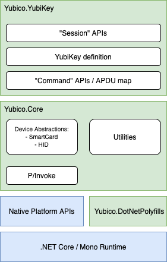

<!-- Copyright 2021 Yubico AB

Licensed under the Apache License, Version 2.0 (the "License");
you may not use this file except in compliance with the License.
You may obtain a copy of the License at

    http://www.apache.org/licenses/LICENSE-2.0

Unless required by applicable law or agreed to in writing, software
distributed under the License is distributed on an "AS IS" BASIS,
WITHOUT WARRANTIES OR CONDITIONS OF ANY KIND, either express or implied.
See the License for the specific language governing permissions and
limitations under the License. -->

# Overview of the SDK

The YubiKey SDK for Desktop is a collection of libraries, samples, and documentation that target
the .NET ecosystem. It supports the macOS and Windows operating systems and is capable of speaking
to USB and NFC based YubiKeys. Use the NuGet package manager to install the SDK into your project.
You can learn more about this process on the [how to install the SDK](how-to-install.md) page.

## Supported platforms

Modern .NET supports more than just Microsoft Windows, and so do we. Support for macOS is built in,
and has been tested on both Intel and Apple Silicon (i.e. M1) platforms. (Apple Silicon is supported
through Rosetta 2.) We also support common Linux distributions such as Debian, Ubuntu, RHEL, and CentOS.
Other distros may still work, but they have not been tested by the SDK team.

Future distribution and platform support will be driven by customer interest.

This SDK targets .NET Standard 2.0, allowing for a wide reach of .NET platforms.
See [this page](https://docs.microsoft.com/en-us/dotnet/standard/net-standard) for more
information on what .NET implementations support .NET Standard 2.0. Note that while this SDK may build
with Xamarin and Mono, only the Windows and macOS operating systems are supported at this time.
Additionally, while .NET Framework 4.6.x is listed as implementing Standard 2.0, this is not
entirely true. The SDK relies on certain cryptographic functionality that is defined
in the standard but not actually implemented in Framework 4.6.x.

| Platform | Architecture | Version |
| ---- | ---- | ---- |
| macOS | x64, arm64 | Catalina, Big Sur |
| Windows | x86, x64, arm64 | Windows 10, Windows 11 |
| Linux | x86, x64, arm64 | Debian, Ubuntu, RHEL, CentOS |

## Supported YubiKey applications

The YubiKey is a versatile security key that supports numerous standards and protocols. This SDK offers
full support for integrating with Yubico OTP, along with the OATH, PIV, and FIDO U2F standards.

### OTP

Yubico OTP is a simple yet strong authentication mechanism that is supported by all
YubiKeys out of the box. Yubico OTP can be used as the second factor in a 2-factor authentication scheme
or on its own, providing 1-factor authentication.

Read more about OTP [here](xref:OtpOverview).

### OATH

The Initiative for Open Authentication (OATH) is an organization that specifies two
open one-time password standards: HMAC OTP (HOTP) and the more familiar Time-based OTP (TOTP).
Read more about OATH [here](xref:OathOverview).

### PIV

Personal Identity Verification (PIV), or FIPS 201, is a US government standard. It enables
RSA signing and encryption, along with ECC signing and key agreement operations using a
private key stored on a smart card (such as the YubiKey 5).

PIV is primarily used for non-web applications. It has built-in support under Windows and
can be used on macOS as well.

Read more about PIV [here](xref:PivOverview).

### FIDO U2F

U2F is an open authentication standard that enables keychain devices, mobile phones and other
devices to securely access any number of web-based services - instantly and with no drivers or
client software needed. U2F was created by Google and Yubico, with contribution from NXP, and is
today hosted by the open-authentication industry consortium [FIDO Alliance](https://fidoalliance.org/).
The technical specifications were launched in late 2014, including native support in Google
Accounts and Chrome, and have since resulted in a thriving ecosystem of hardware, software
and service providers.

Read more about FIDO U2F [here](xref:FidoU2fOverview).

### FIDO2

FIDO2 is the "second generation" of the FIDO open authentication standard. It is similar to U2F
in that implementations allow instant secure access to web-based services, with no drivers or
client software needed. FIDO2 was created by the [FIDO Alliance](https://fidoalliance.org/) -- a
consortium of dozens of tech and other companies as well as government organizations from around the
world -- along with the [W3C](https://www.w3.org) (World Wide Web Consortium). The technical
specifications for FIDO2 were launched in 2018. Today, many [browsers and mobile platforms support
FIDO2](https://support.yubico.com/hc/en-us/articles/360016615020-Operating-system-and-web-browser-support-for-FIDO2-and-U2F).

Read more about FIDO2 [here](xref:Fido2Overview).

### YubiHSM Auth

YubiHSM Auth is a YubiKey CCID application that stores the long-lived credentials used to establish
secure sessions with a YubiHSM 2. The secure session protocol is based on Secure Channel Protocol 3
(SCP03). YubiHSM Auth is supported by YubiKey firmware version 5.4.3.

YubiHSM Auth uses hardware to protect these long-lived credentials. In addition to providing robust
security for the YubiHSM Auth application itself, this hardware protection subsequently increases the
security of the default password-based solution for YubiHSM 2's authentication.

Read more about YubiHSM Auth [here.](xref:YubiHsmAuthOverview)

## SDK components

The YubiKey SDK is comprised of three managed assemblies:

- **Yubico.YubiKey** is the primary assembly that contains all of the classes and types needed for
  interacting with the YubiKey.
- **Yubico.Core** is a common library used by Yubico's .NET offerings and serves as a platform
  abstraction layer (PAL). All interaction with operating-system specific functionality is contained
  within this library. It also contains useful utility classes that can be used for encoding and
  decoding different kinds of data, such as Base32, Tag-Length-Value (TLV), and ModHex.
- **Yubico.DotNetPolyfills** is an internal library used to backport certain .NET base class library (BCL)
  features needed by the SDK. Types in this assembly are subject to change and are not meant for
  general public consumption. If you wish to use the newest features of .NET, you should target
  the .NET implementation that contains those features directly.
- **Yubico.NativeShims** is an internal unmanaged library that provides a stable Application
  Binary Interface (ABI) to the P/Invoke Foreign Function Interface (FFI) in Yubico.Core.
  
All components of the SDK are built to the .NET Standard 2.0 specification. This means that either
.NET Framework, .NET Core, or Mono can be used as the underlying runtime, so long as the runtime version implements .NET Standard 2.0 or higher.



The SDK takes as few dependencies as possible. Most of the functionality is built directly on top
of the .NET base class libraries or on top of the platform native APIs (called through P/Invoke).

### Yubico.YubiKey

Yubico.YubiKey is where concepts like a YubiKey take shape. This assembly builds on top of Yubico.Core’s
platform abstractions for USB and NFC to create a model for what a YubiKey looks like.

The Yubico.YubiKey assembly can be broken down into three main areas: YubiKey device definitions,
low-level commands, and application libraries.

#### YubiKey definition

Developing against the .NET YubiKey SDK, one should only ever have to talk about a YubiKey in the abstract.
A minimal interface for what defines the lowest common denominator (including Security Keys) should be all
that is required, agnostic to the physical transport on which it was discovered.

In practice, the SDK will need to be aware of and implement three different kinds of YubiKeys: USB, NFC,
and EAP. The decision to slice implementations at this level is due to the disparate nature in which
communication is performed over each transport. USB must be aware of multiple interfaces (Keyboard, CCID,
HID FIDO), whereas NFC and EAP only have one. NFC has to deal with potentially high failure and retry rates,
while the others may not.

Additionally, the way a YubiKey is discovered over each transport is different. On USB, a combination of
Vendor ID and Product ID is used. NFC, the ATR is used. EAP, the vendor protocol.

#### Command APIs

Communication with a YubiKey, regardless of physical or logical transport, essentially boils down to an APDU.
If CCID / ISO7816 is not being used, then the alternate command (say, a HID frame) can usually be derived
from the APDU.

The fundamental part of the Yubico.YubiKey assembly will be a near 1:1 mapping between a "command" class and
a YubiKey command or APDU. These classes will essentially be a developer-friendly, parameterized method for
constructing raw APDUs to send to the YubiKey.

While exposed by the public API surface, it is not expected that external developers would choose to program
applications at this layer. The low-level command definitions are to support Yubico internal applications, as
well as the final higher-level APIs described in the next section.

One important concept to note: these command classes are essentially free-standing. They can be used with or
without the presence of a YubiKey. When instantiated, a developer has the ability to serialize the command
into a byte stream that can be stored or sent to a YubiKey via alternate means. Additionally, if a command
expects a response, a response class will be present which will be capable of deserializing a byte stream into
a strongly typed, parsed representation of the response.

#### Session APIs

The session APIs round out the YubiKey SDK. They represent the connection to an application session on the
YubiKey. From this session, you can interact with the application in an intuitive and high level way.

These APIs are the ones that most developers will want to interact with when developing software for the
YubiKey. Many operations are either a single method call, or employ a set of easy to use helper classes
to construct the necessary input.

For example, if you want to use the PIV smart card functionality and generate a keypair using the YubiKey,
you could write code like the following:

```C#
using System.Linq;
using Yubico.YubiKey; // Necessary for the YubiKey definition
using Yubico.YubiKey.Piv; // Use the PIV functionality of the SDK

public static class Program
{
    public static void Main()
    {
        // The SDK may return zero, one, or more YubiKeys. If there
        // was more than one, let's simply use the first.
        IYubiKeyDevice yubiKey = YubiKeyDevice.FindAll().First();
        
        // Open a sesion to the PIV application on the YubiKey that
        // we selected in the previous step.
        using (PivSession piv = new PivSession(yubiKey))
        {
            // Generate a public-private keypair
            var publicKey = piv.GenerateKeyPair(
                PivSlot.CardAuthentication,
                PivAlgorithm.Rsa2048);
        }
    }
}
```

With a single (wrapped) line, you are able to generate a 2048-bit RSA keypair in the Card Authentication
slot. Many of the YubiKey operations are able to be reduced to a single line of code line this.

Look for the
[OtpSession](xref:Yubico.YubiKey.Otp.OtpSession),
[OathSession](xref:Yubico.YubiKey.Oath.OathSession), and
[PivSession](xref:Yubico.YubiKey.Piv.PivSession)
classes to get started.

### Yubico.Core

The Yubico.Core library contains a set of utility classes that are not specific to a particular Yubico
product. It also contains all of the platform abstraction logic required for other .NET-based Yubico libraries
to run across different platforms and operating systems.

For most consumers of the SDK, this library will automatically be included when you reference the `Yubico.YubiKey`
NuGet package.

### Yubico.DotNetPolyfills

Yubico.DotNetPolyfills is a support project for .NET-based Yubico libraries. It is not to be consumed. Yubico
will not make any effort at providing a stable API surface around this assembly, and it may have breaking changes
applied to it at any point in time. Its purpose is to provide the SDK, which targets .NET Standard 2.0, with missing
APIs so that we can leverage certain newer features. If you wish to use the latest features of .NET, your library
or application should target a newer standard. If that is not possible, we recommend that you invest in creating
your own polyfills library. This way, you can implement precisely what your project needs and not have to rely on
what may or may not be implemented here.
