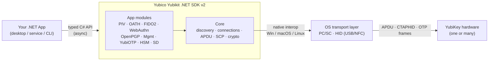
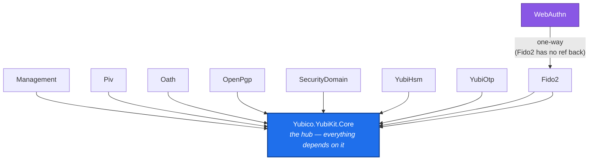
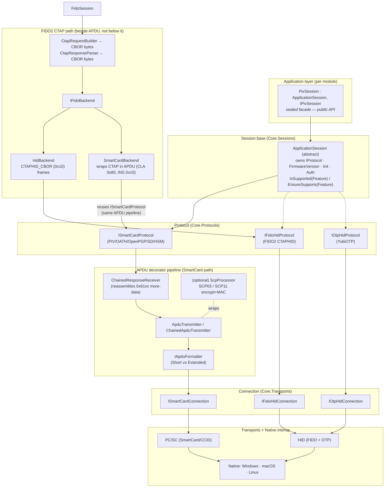
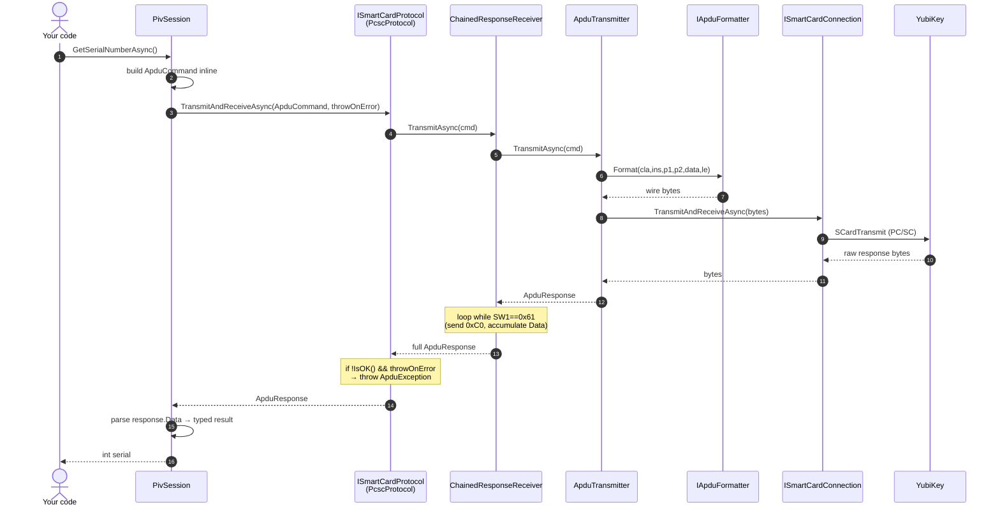
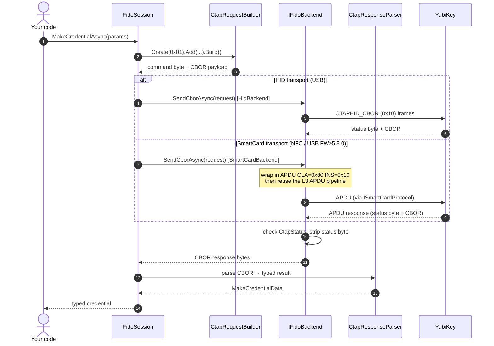
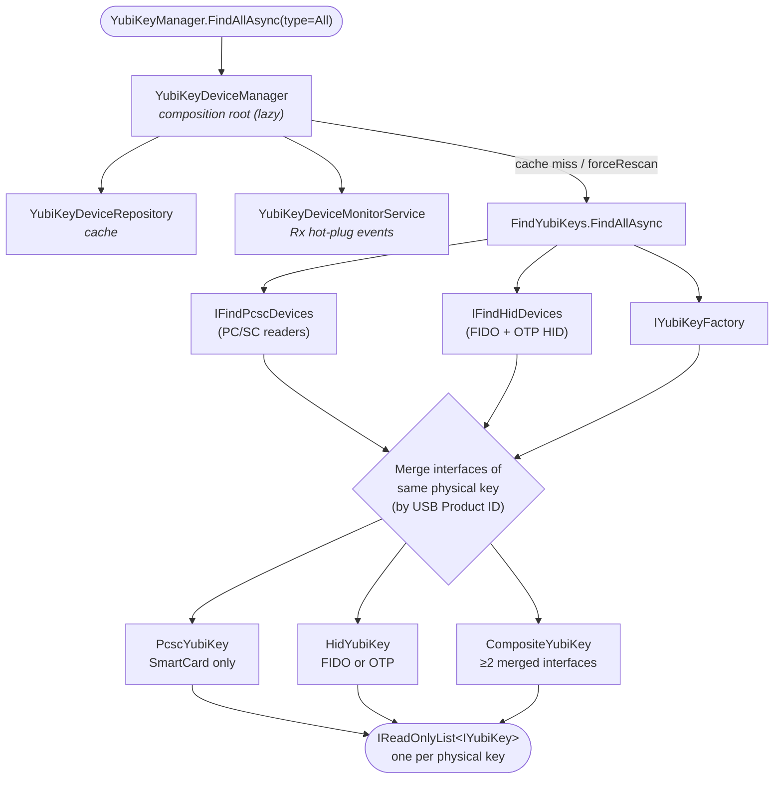
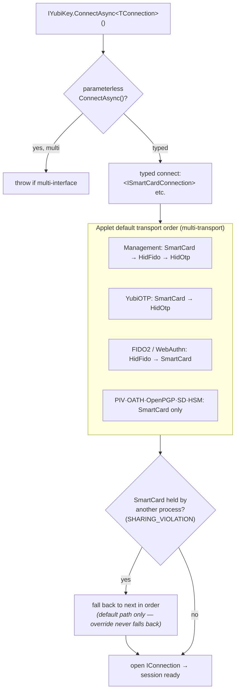

# Yubico Yubikit .NET SDK v2 — Architecture Diagrams

> **Study & presentation material.** Layered mermaid diagrams at progressive zoom depths.
> Branch: `yubikit-consolidation`. Source of truth: `src/<Module>/src/*.csproj` + `docs/architecture/`.
>
> **How to use these:** Read top to bottom. Each level zooms in one step. For a talk, one
> diagram per slide, in this order. For learning, study L2–L4 with the code open beside you —
> every box is a real type you can grep for.

---

## L0 — Context: what the SDK is

The 10,000ft view. One glance answers "what does this thing do and where does it sit."



**Teaching note:** the SDK is *authenticator-side* — it talks to the key. Server-side / RP
verification (WebAuthn assertion checking) is deliberately **not** the SDK's job.

---

## L1 — Assembly dependency graph

Which shipping assembly depends on which. This is the single most important slide for
"how is the codebase organized." Edges are real `<ProjectReference>` entries.



**Key facts to say out loud:**
- **Core is the only hub.** Every app module has exactly *one* project reference → Core.
- **WebAuthn is the only 2nd-level module:** `Core ← Fido2 ← WebAuthn`. WebAuthn is a
  higher-level client over Fido2 and must never duplicate CTAP behavior.
- App modules **do not** reference each other. They are independent verticals over Core.
- (Not shown: CLI/test/example projects — noise for an architecture talk.)

---

## L2 — Layered stack: how one module is built

Zoom into a single app module (PIV shown) and see the layers from public API down to
the metal. This is the mental model that transfers to *every* module.



**Teaching notes:**
- **Two-phase init pattern (memorize this):** private ctor stores connection →
  static `CreateAsync(...)` does async selection + `InitializeCoreAsync(...)`.
- **Deliberately flat command model:** there are **no** `SignCommand`/`VerifyPinCommand`
  classes. Session methods build the `ApduCommand` inline. (FIDO2 is the exception — it
  builds CBOR via `CtapRequestBuilder`.)
- **Transport split:**
  - *SmartCard-only:* PIV, OATH, OpenPGP, SecurityDomain, YubiHSM.
  - *Backend pattern (multi-transport):* Management, Fido2, YubiOTP — an `IxxxBackend`
    interface with a `SmartCard` impl and a `Hid` impl.
- **FIDO2 CTAP path (the box beside APDU):** FIDO2 does **not** build APDUs at the session
  layer — it builds **CBOR** via `CtapRequestBuilder` and parses replies via
  `CtapResponseParser`. That CBOR then goes through `IFidoBackend`, which has two impls:
  - `HidBackend` — sends CTAPHID_CBOR frames (command `0x10`) over `IFidoHidProtocol`.
    This is the genuinely separate path.
  - `SmartCardBackend` — wraps the CTAP payload in a single APDU (`CLA 0x80, INS 0x10`) and
    **reuses `ISmartCardProtocol` — the exact same APDU decorator pipeline** as PIV/OATH.
    Used for NFC and (FW 5.8.0+) USB SmartCard FIDO2.
- **The "aggregate them later" story:** the two paths already converge. Only `HidBackend` is
  distinct; `SmartCardBackend` is a thin CTAP-in-APDU adapter over the shared pipeline. So the
  diagram is deliberately drawn as **CTAP beside APDU, with the SmartCard backend rejoining the
  APDU pipeline** — the honest picture, and the slide that motivates a future merge.

---

## L3 — Command execution: how one API call becomes bytes and back

The dynamic view. Trace a single SmartCard operation (e.g. `PivSession.GetSerialNumberAsync`)
end-to-end. This is the "aha" slide — it shows the decorator pipeline in motion.



**Teaching notes:**
- **Decorator pipeline:** `ChainedResponseReceiver` (response reassembly) wraps
  `ApduTransmitter` (send) wraps `IApduFormatter` (wire serialization). Each layer has one job.
- **Short vs Extended APDU** is chosen by firmware + `SupportsExtendedApdu()` at
  `Configure()` time. Extended = FW ≥ 4.0; short path uses `ChainedApduTransmitter` to split.
- **SCP variant:** if `scpKeyParams` were passed, an `ScpProcessor` sits in the chain and
  encrypts/MACs every APDU before it hits the wire, decrypts on the way back.
- **Security detail worth mentioning:** the wire buffer is zeroed in a `finally` — the SDK
  is disciplined about not leaving sensitive bytes in memory.

### L3b — the FIDO2 CTAP variant (same shape, different bytes)

Trace `FidoSession.MakeCredentialAsync`. Note it's the *same* two-transport idea, but the
payload is CBOR, not an APDU — and over SmartCard it collapses back onto the APDU pipeline.



**Teaching notes (FIDO2):**
- **CBOR in, CBOR out** — `CtapRequestBuilder` / `CtapResponseParser` replace the inline
  `ApduCommand` build that every other module uses. This is *the* FIDO2 exception to the flat
  command model.
- **Status byte convention:** the authenticator's reply starts with a single `CtapStatus`
  byte; the backend checks it (`CtapException.ThrowIfError`) then strips it before parsing.
- **The convergence point:** in the SmartCard branch, everything below "wrap in APDU" is the
  *identical* pipeline from L3 — this is why the two paths can eventually merge.

---

## L4 — Device discovery & connection flow

How the SDK finds keys and opens a connection. Answers "how do I get from nothing to a
usable YubiKey object." Entry point is the **static** `YubiKeyManager` — no DI required.



### Then: connecting (transport selection)



**Teaching notes:**
- **One `IYubiKey` = one physical key.** It exposes `AvailableConnections`
  (`SmartCard | HidFido | HidOtp` flags). Three concrete impls: `PcscYubiKey`, `HidYubiKey`,
  `CompositeYubiKey`.
- **Merge logic** is conservative: interfaces merge by USB Product ID; NFC is never merged
  with USB; ambiguity → surface as separate rows rather than mis-merge.
- **Monitoring:** `StartMonitoring()` gives an `IObservable<DeviceEvent> DeviceChanges`
  (System.Reactive) for hot-plug — good "advanced" slide if time allows.

---

## Appendix — the 6 types to memorize first

If your audience remembers only six names, make it these:

| Type | Layer | Why it matters |
|---|---|---|
| `YubiKeyManager` | discovery | static entry point — how you find keys |
| `IYubiKey` | device model | one physical key; `ConnectAsync<T>()` |
| `IConnection` | transport | base for SmartCard / FIDO-HID / OTP-HID connections |
| `ApplicationSession` | session base | firmware, init, auth, protocol ownership — the pattern |
| `ISmartCardProtocol` | protocol | the APDU send/receive contract |
| `ApduCommand` / `ApduResponse` | pipeline | the record structs that flow through the decorator chain |

---

## Rendered images

Pre-rendered for slides and offline viewing (regenerate with the command below):

| Level | SVG (scales for print/slides) | PNG (3× raster) |
|---|---|---|
| L0 Context | `images/L0-context.svg` | `images/png/L0-context.png` |
| L1 Assembly deps | `images/L1-assembly-deps.svg` | `images/png/L1-assembly-deps.png` |
| L2 Layered stack (+ FIDO2 CTAP path) | `images/L2-layered-stack.svg` | `images/png/L2-layered-stack.png` |
| L3 APDU sequence | `images/L3-apdu-sequence.svg` | `images/png/L3-apdu-sequence.png` |
| L3b FIDO2 CTAP sequence | `images/L3b-fido2-ctap-sequence.svg` | `images/png/L3b-fido2-ctap-sequence.png` |
| L4 Discovery | `images/L4-discovery.svg` | `images/png/L4-discovery.png` |
| L4 Connection | `images/L4-connection.svg` | `images/png/L4-connection.png` |

Regenerate after editing the diagrams:

```bash
# SVG (vector — best for slides)
mmdc -i docs/architecture/sdk-architecture-diagrams.md -o docs/architecture/images/sdk.svg -t neutral -b transparent
# PNG (3× raster)
mmdc -i docs/architecture/sdk-architecture-diagrams.md -o docs/architecture/images/png/sdk.png -t neutral -b white -s 3
# then rename sdk-1..7 → L0..L4 per the table above
```

Requires `@mermaid-js/mermaid-cli` (`npm i -g @mermaid-js/mermaid-cli`).

---

*Diagrams generated from `yubikit-consolidation`. Verify against source before presenting;
type names cited are grep-able in `src/Core/src/` and `src/<Module>/src/`.*
