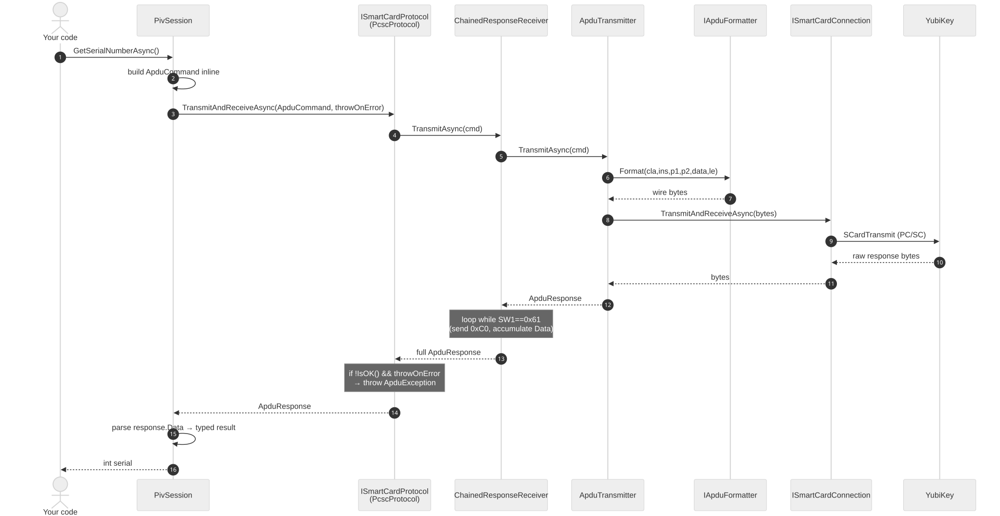
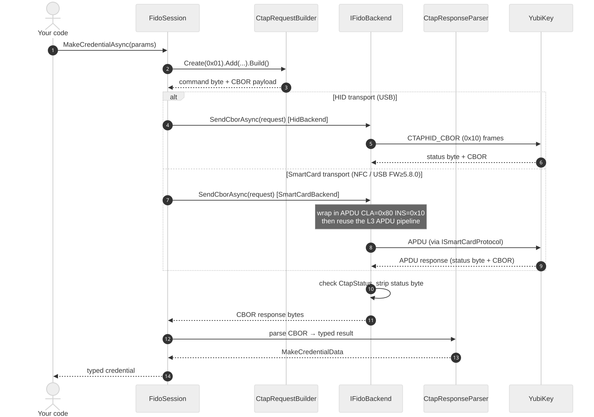

<!-- _class: lead -->

# YubiKit .NET **v2**

### A tour for people who live in the other SDKs

`yubikey-manager` · `yubikit-android` · `yubikit-swift` · `python-fido2`

<br>

- **Async on the golden path** — every applet operation is `async`; the few sync
  members that remain are deliberate lifecycle and transaction escapes
- **Install only what you use** — ten packages, not one monolith; a PIV app ships
  742 KiB against v1's unavoidable 890 KiB
- **Native AOT** — ships as a standalone native binary: no JIT, no runtime install,
  11.7 MiB resident with the whole SDK linked
- **Event-driven discovery** — OS notifications
- **One session shape** — learn one applet, you know the rest

<br>

Branch `yubikit` @ `d04d59aa` · 2026-09-07


---

## Host App → SDK → Session → YubiKey



---

## The pipeline in code

```csharp
// 1. HOST APP asks the SDK for devices
var keys = await YubiKeyManager.FindAllAsync();
IYubiKey key = keys[0];

// 2. SESSION — convenience: the session owns a hidden connection
await using var piv = await key.CreatePivSessionAsync();

// 3. YUBIKEY executes; the session speaks the applet protocol
var cert = await piv.GetCertificateAsync(PivSlot.Authentication);
```

Every layer boundary is `async`. There is no synchronous escape hatch on the golden path.

---

## Three ways to open a session

```csharp
// A. Convenience — SDK resolves the transport, owns and disposes the connection
await using var piv = await key.CreatePivSessionAsync();

// B. Convenience + options — force a transport, add a secure channel
await using var piv = await key.CreatePivSessionAsync(
    new SessionCreationOptions
    {
        PreferredConnectionType = ConnectionType.SmartCard,
        ScpKeyParameters = scpKeyParams,
    });

// C. Bring your own connection — you own it, you dispose both
await using var conn = await key.ConnectAsync<ISmartCardConnection>();
await using var piv  = await PivSession.CreateAsync(conn);
await using var mgmt = await ManagementSession.CreateAsync(conn);   // after piv is disposed
```

**A** for one-shot work. **B** when the default transport is wrong, or you need SCP.
**C** when several applets share one connection — sequentially; one connection admits
one live session.

<!-- Anchors: FindAllAsync src/Core/src/PublicAPI.Unshipped.txt:985;
     CreatePivSessionAsync src/Piv/src/IYubiKeyExtensions.cs:38;
     GetCertificateAsync src/Piv/src/PublicAPI.Unshipped.txt:191;
     PivSession.CreateAsync src/Piv/src/PivSession.cs:130;
     ConnectAsync<T> src/Core/src/Abstractions/IYubiKey.cs:164;
     SessionCreationOptions fields docs/architecture/applet-public-api.md:10-13;
     SCP-over-session real call site
     src/Management/tests/.../ManagementSessionSimpleTests.cs:212-217;
     one-session-per-connection src/Core/src/Sessions/ConnectionSessionGuard.cs:44-52 -->


---

## Transports and interfaces



---

## Command invocation: smart card / APDU



PIV · OATH · OpenPGP · Management · SecurityDomain · YubiHSM Auth

---

## Command invocation: FIDO HID / CTAP



FIDO2 · WebAuthn. YubiOTP rides OTP-HID, a third framing.

---

## Applets are not one-transport-each

`[Flags] ConnectionType`: `Unknown=0` · `Hid=1` · `HidFido=2` · `HidOtp=4` · `SmartCard=8` · `All`

| Applet | Default transport order |
|---|---|
| **Management** | `SmartCard` → `HidFido` → `HidOtp` |
| **FIDO2** | `HidFido` → `SmartCard` |
| **WebAuthn** | inherits FIDO2's order |
| **YubiOTP** | `SmartCard` → `HidOtp` |
| PIV · OATH · OpenPGP · SecurityDomain · YubiHSM | `SmartCard` only |

- FIDO2's SmartCard path is **NFC, or USB-CCID on firmware 5.8.0+**.
- **YubiOTP prefers SmartCard**, not HID — on a CCID-enabled key the YubiOTP snippet
  later in this deck runs over APDU.
- Supplying `ScpKeyParameters` **forces SmartCard** when no preference is given.

```csharp
await using var mgmt = await key.CreateManagementSessionAsync(
    new SessionCreationOptions { PreferredConnectionType = ConnectionType.HidFido });
```

<!-- Anchors: Management src/Management/src/IYubiKeyExtensions.cs:143-144;
     Fido2 src/Fido2/src/IYubiKeyExtensions.cs:189-190, FW5.8 note :95;
     YubiOtp src/YubiOtp/src/IYubiKeyExtensions.cs:144-145;
     SCP-forces-SmartCard Management:109, Fido2:132, YubiOtp:110;
     single-transport Piv:46 Oath:47 OpenPgp:45 SecurityDomain:53 YubiHsm:49;
     ConnectionType src/Core/src/Devices/ConnectionType.cs:19-25 -->


---

## Device discovery



---

## Discovery API

```csharp
// Cached — the repository's current view
var keys = await YubiKeyManager.FindAllAsync();

// Fresh scan, or narrowed by transport
var scan = await YubiKeyManager.FindAllAsync(
    ConnectionType.SmartCard, forceRescan: true);
```

**Is `forceRescan` obsolete now that discovery is event-driven?** No — but its job
has narrowed to exactly one case:

| | Cache freshness | Need `forceRescan`? |
|---|---|---|
| **Monitoring on** | the monitor keeps it fresh | **no** — it is redundant |
| **Monitoring off** | first call scans, then the cache never updates | **yes** — the only way to refresh |

So it is the escape hatch for callers who want a one-shot look and never call
`StartMonitoring()`. If you are monitoring, stop passing it.

Discovery is **publish-first and degraded-state tolerant** — a key is published as soon
as it is enumerated, even if its metadata read has not succeeded. Canonical Rust
instead withholds publication until metadata is read, which is why `SerialNumber` can
arrive late here and not there.

<!-- Anchors: PublicAPI.Unshipped.txt:984-985;
     caching + "monitoring keeps cache fresh" src/Core/src/Devices/YubiKeyManager.cs:286-300;
     race-condition guidance docs/usage/device-discovery.md:202-209;
     publish-first docs/architecture/device-identity.md:93-96 -->


---

## Merging: one physical key, many interfaces

A single YubiKey appears as **several OS-level devices** — a PC/SC reader, a FIDO HID
device, an OTP HID device. The SDK merges them into one `IYubiKey`.

```
USB PC/SC reader  ─┐
FIDO HID device   ─┼─→  CompositeDeviceMerger  ─→  one IYubiKey
OTP HID device    ─┘

NFC reader        ───→  stands alone, never merged
```

Merge inputs per interface: `Connection` · `IsUsb` · `Pid` · `Serial` · `DeviceInfo` ·
`TopologyKey` (Windows Container ID; `null` on macOS and Linux)

<!-- Anchors: src/Core/src/Devices/CompositeDeviceMerger.cs:19-30 (doc), :40-48 (descriptor);
     NFC/unknown-kind never merge :24-27, :119-124;
     PhysicalIdentityKeyFor src/Core/src/Devices/YubiKeyDevice.cs:123 -->

---

## What happens to an NFC key

NFC is **discovered and monitored exactly like USB** — the same
`SCardGetStatusChange` listener covers NFC readers, so tap and remove raise the
same `Added` / `Removed` events, and the same repository cache holds them.

What differs is **grouping**, and only grouping:

- Merging needs USB evidence — Product ID from the reader name, or a Windows
  Container ID. An NFC reader has neither.
- So an NFC-presented key is **published standalone**, with a transport-shaped
  `DeviceId` (`pcsc:*`), not a `ykphysical:*` one.
- Tap the same key over USB and NFC at once and you get **two `IYubiKey` objects**.
  The SDK will not claim they are one physical key, because nothing proved it.
- The honest correlator is `SerialNumber` — read it from both and compare.

This is conservative on purpose: a wrong merge is worse than no merge.

<!-- Anchors: NFC never merges src/Core/src/Devices/CompositeDeviceMerger.cs:24-27,
     standalone :119-124; no topology probe for non-USB
     src/Core/src/Devices/FindYubiKeys.cs:191;
     transport-shaped DeviceId docs/architecture/device-identity.md:179 (D7) -->

---

## Identity: what is stable, what is not

| Surface | Guarantee |
|---|---|
| `DeviceId` | **Diagnostic only.** Not durable identity. |
| `SerialNumber` | `null` → value, **never** back to `null`. |
| Interface-set key | Internal, machine-local, never public |
| `Equals` / `GetHashCode` | **Referential** — same object, or not equal |

- `SerialNumber` may stay `null` **forever**: reads fail, budgets exhaust, and the
  Security Key series reports no serial at all.
- It can flip `null` → value **after** publication, with **no** device event.
- A key whose interface set changes is **republished as a new object** that inherits
  nothing from its predecessor.

> **Why keep `DeviceId` public at all?** Its prefix encodes *which evidence tier
> produced it*: `pcsc:*` / `hid:*` for a lone interface, `ykphysical:*` only once
> grouping actually proved a physical key. That makes it genuinely useful in logs
> and bug reports. Removing it was considered and rejected for that reason — but
> it is the interface-set key, kept internal, that would be the wrong thing to expose.

<!-- Anchors: device-identity.md D1 :61-65, D2 :67-98 (latch :76-77, null-forever :73-75,
     late arrival :80-81, republication :82-84), D6 :161, D7 :179-184;
     "not as the current interface-set string" :188-190 -->


---

## Observability: the whole device-event API

```csharp
YubiKeyManager.StartMonitoring();                 // events don't flow until this

await foreach (var e in YubiKeyManager.WatchAsync())
{
    Console.WriteLine($"{e.Action}: {e.Device.DeviceId}");
}
```

```csharp
public enum DeviceAction { Added, Removed }
public class DeviceEvent { IYubiKey Device; DeviceAction Action; DateTime Timestamp; }
```

The monitoring **control** surface is five members: `StartMonitoring()`,
`StartMonitoring(TimeSpan)`, `StopMonitoring()`, `WatchAsync(ct)`, `IsMonitoring`.
`Shutdown()` / `ShutdownAsync()` also stop monitoring as part of tearing the manager down.

<!-- Anchors: src/Core/src/PublicAPI.Unshipped.txt:986-992 (incl. Shutdown :987, ShutdownAsync :988);
     ShutdownAsync stops monitoring src/Core/src/Devices/YubiKeyManager.cs:216;
     src/Core/src/DeviceEvent.cs:19-30; docs/usage/device-discovery.md:126 -->

---

## How the peers surface device changes

| SDK | Attach / detach |
|---|---|
| **.NET v2** | `await foreach WatchAsync()` — OS-notification driven |
| `yubikey-manager` (Python) | **Poll only** — `scan_devices()` in a `sleep` loop |
| `yubikey-manager` (rust) | `monitor_yubikeys(cb)` — udev / `WM_DEVICECHANGE` / `IOHIDManager` |
| `yubikit-android` | Callbacks — `Callback<T>.invoke` attach, `setOnClosed` detach |
| `yubikit-swift` | **Connect-on-demand** — `makeConnection()` polls; `waitUntilClosed()` |
| `python-fido2` | **None** — `list_devices()` enumerates on call |

Two things worth noting: rust has a third variant, `YubiKeyEvent::Changed`, that .NET
does not. And Swift's `makeConnection()` is a 1-second poll loop internally, not an
OS notification.

<!-- Anchors: ykman ykman/device.py:108; rust monitor.rs:1113, examples/monitor_yubikeys.rs:87;
     android YubiKitManager.java:82-84, UsbYubiKeyDevice.java:154;
     swift@1.4.0 Connection.swift:32, USBSmartCardConnection.swift:53-55;
     python-fido2 fido2/hid/__init__.py:275-278 -->


---

## Observability: logging

**Off by default.** No output, no logger, no overhead until you opt in.

```csharp
// Silent — the default
var keys = await YubiKeyManager.FindAllAsync();

// One line, before you touch the SDK
YubiKitLogging.Configure(loggerFactory);
```

Six documented setups: static, DI, ASP.NET Core, `appsettings.json`, Serilog, none.
Categories are class names — `Yubico.YubiKit.Piv.PivSession`,
`Yubico.YubiKit.Core.Transports.SmartCard.*` — so you can filter per applet or
per transport.

| Level | What lands there |
|---|---|
| `Trace` | Raw APDU / CBOR bytes, protocol steps |
| `Debug` | State transitions, cache updates |
| `Information` | Session creation, major operations |
| `Warning` / `Error` | Recoverable fallback / operation failure |

**Never logged:** PINs, PUKs, passwords, private keys, session keys.
Serial numbers and credential IDs are public identifiers and may appear at `Debug`.

<!-- Anchors: docs/LOGGING.md:5-14 (quick start), :17-20 (off by default),
     :22-137 (six methods), :139-151 (categories), :153-161 (levels),
     :201-212 (security), :219 (never inject ILogger) -->

---

## Logging: we already agree across the SDKs

| SDK | Default | Facade | Enable | Logger obtained |
|---|---|---|---|---|
| **.NET v2** | silent | `Microsoft.Extensions.Logging` | `YubiKitLogging.Configure(f)` | **static** |
| ykman (py) | silent | stdlib `logging` | `init_logging(level)` | per-module |
| ykman (rust) | silent | `log` crate | install a `log` impl | macros, per call site |
| yubikit-android | silent | **slf4j** | add a binding | per-class |
| yubikit-swift | silent | `OSLog` | on by platform | static, per domain |

Three conventions we already share, without ever having agreed them:

1. **A facade, never a concrete logger.** Every SDK binds to an abstraction and lets
   the host pick the sink.
2. **Silent until configured.** No SDK here prints anything out of the box.
3. **Raw protocol bytes go to `Trace`.** Android says so explicitly; .NET puts APDU
   and CBOR there too.

> **Nobody injects a logger into a session.** All five obtain one statically or
> per-module. .NET v2's "never inject `ILogger`" is not a .NET quirk — it is the
> house style everywhere, and it is what keeps the SDK usable without a DI container.
>
> Worth knowing: Android *used* to have a settable static `Logger.setLogger()` and
> deliberately moved off it to slf4j, calling the old approach "not scalable".

<!-- Anchors: .NET docs/LOGGING.md:219;
     python yubikit/core/__init__.py:31,44 (getLogger(__name__)), ykman/logging.py:57,67;
     rust crates/yubikit/Cargo.toml:30 (log crate), src/piv.rs:1210 (log::debug!);
     android doc/Logging_Migration.adoc:5-7 (slf4j move, "not scalable"), :10 (TRACE for raw data);
     swift@1.4.0 YubiKit/YubiKit/Utilities/Logger+Extensions.swift:17-39 (HasLogger, OSLog) -->


---

## Going below the applet API: three tiers

| Tier | What it gives you | What you take on |
|---|---|---|
| **0 — Applet session** | applet semantics, feature gates, protocol state | nothing |
| **1 — Raw session** | APDU/CTAP framing, chaining, overlap refusal, SCP | payload semantics |
| **2 — Raw connection** | a pipe | *everything* |

```csharp
await using var piv  = await key.CreatePivSessionAsync();           // Tier 0
await using var raw  = await key.CreateRawSmartCardSessionAsync();  // Tier 1
await using var conn = await key.ConnectAsync<ISmartCardConnection>();
var rsp = await conn.TransmitAndReceiveAsync(rawBytes);             // Tier 2
```

Tier 1 does **not** select an applet or apply feature gates. At Tier 2 you own APDU
formatting, chaining, response correlation, CRC validation, keep-alive, sequencing, and
recovery from partial or cancelled exchanges.

Dropping a tier does **not** drop transport safety — raw sessions still obey
one-connection-per-key and one-session-per-connection.

> This is the supported answer for teammates hand-rolling APDUs in `ykman` today:
> there is a place to do that, and it is Tier 1, not Tier 2.

<!-- Anchors: docs/architecture/raw-access-tiers.md:6-16 (T0), :19-33 (T1),
     :136-145 (T2), :30-33 (safety still applies);
     src/Core/src/Devices/YubiKeyConnectionExtensions.cs:37,90,108;
     Tier 2 signature takes ReadOnlyMemory<byte> src/Core/src/PublicAPI.Unshipped.txt:655
     (Tier 1 takes ApduCommand, :535) -->


---

## One session shape — for eight of the nine

```csharp
await using var s = await key.CreateXSessionAsync(options, cancellationToken);
```

- A sealed `XSession` plus a matching `IXSession` interface
- `IYubiKey.CreateXSessionAsync(...)` — session owns a hidden connection
- `XSession.CreateAsync(connection, ...)` — session borrows yours
- Both take `SessionCreationOptions?` then a defaulted `CancellationToken`
- Always `await using`

> **WebAuthn is the deliberate exception.** It is not an applet session. It returns a
> `WebAuthnClient`, takes a required origin and public-suffix checker, and has its own
> factory test. The test file says so in as many words:
> *"WebAuthn is not an applet session and has its own factory test."*

<!-- Anchors: grammar docs/architecture/applet-public-api.md:3-9;
     eight sessions src/PublicApi/tests/.../AppletSessionShapeTests.cs:16-26;
     exclusion FactoryShapeTests.cs:56, WebAuthn factory shape :94-127 -->

---

## Ownership: who disposes the connection

```csharp
// Convenience — the session owns a hidden connection and disposes it
await using var piv = await key.CreatePivSessionAsync();
```

```csharp
// Direct factory — you own the connection, you dispose both
await using var conn = await key.ConnectAsync<ISmartCardConnection>();
await using var mgmt = await ManagementSession.CreateAsync(conn);
var info = await mgmt.GetDeviceInfoAsync();
```

**One key admits one live connection. One connection admits one live session** —
a second `Attach` throws `ConnectionInUseException`. Dispose session N before creating
N+1 over the same connection. Prefer `DisposeAsync`; sync `Dispose` blocks to drain.

| SDK | Who owns the connection |
|---|---|
| **.NET v2** | Both, named explicitly at the call site |
| ykman (Python) | Caller — `with dev.open_connection(...)` |
| ykman (rust) | Session **consumes** it; returns `(Error, Connection)` on failure |
| yubikit-android | Session borrows, but `close()` closes the connection too |
| yubikit-swift | Caller owns; session never closes it |

<!-- Anchors: real call site src/Management/tests/.../ManagementSessionSimpleTests.cs:40-43;
     OwnConnection src/Piv/src/IYubiKeyExtensions.cs:59;
     rules docs/architecture/raw-access-tiers.md:149-152,158-159;
     enforcement src/Core/src/Sessions/ConnectionSessionGuard.cs:44-52;
     peers: python yubikit/core/__init__.py:182; rust management.rs:34;
     android SmartCardProtocol.java:125-127; swift@1.4.0 PIVSession.swift:67 -->


---

## Management

Read device info, toggle capabilities, write device config.

```csharp
var info = await key.GetDeviceInfoAsync();   // no session needed
```

<div class="cols">

**ykman (Python)**
```python
mgmt = ManagementSession(conn)
info = mgmt.read_device_info()
```

**yubikit-swift**
```swift
let s = try await Management.Session.makeSession(connection: connection)
let info = try await s.getDeviceInfo()
```

</div>

**Delta:** .NET gives Management a device-level shortcut — no session boilerplate for the
most common read. It is also the widest applet: three transports, `SmartCard → HidFido →
HidOtp`. Swift covers two, with `SmartCardConnection` and `FIDOConnection` overloads.

<!-- Anchors: .NET shortcut src/Management/src/PublicAPI.Unshipped.txt:33,
     transports src/Management/src/IYubiKeyExtensions.cs:143-144;
     python yubikit/support.py:83, yubikit/management.py:598;
     swift@1.4.0 ManagementSession.swift:142 (SmartCard), :159 (FIDO), :72 -->

---

## PIV

Certificates, key pairs, PIN/PUK, attestation.

```csharp
await using var piv = await key.CreatePivSessionAsync();
var cert = await piv.GetCertificateAsync(PivSlot.Authentication);
```

<div class="cols">

**ykman (Python)**
```python
piv = PivSession(conn)
cert = piv.get_certificate(SLOT.AUTHENTICATION)
```

**yubikit-android**
```java
PivSession piv = new PivSession(smartCardConnection);
X509Certificate cert = piv.getCertificate(Slot.AUTHENTICATION);
```

</div>

**Delta:** all three return a real certificate type — `X509Certificate2`,
`x509.Certificate`, `java.security.cert.X509Certificate`. The .NET difference is
**nullability**: an empty slot returns `null` rather than throwing.

<!-- Anchors: .NET src/Piv/src/IYubiKeyExtensions.cs:38,
     PublicAPI.Unshipped.txt:191 (X509Certificate2?);
     python yubikit/piv.py:1258; android PivSession.java:882 -->

---

## OATH

TOTP and HOTP credentials, calculate codes, applet password.

```csharp
await using var oath = await key.CreateOathSessionAsync();
var codes = await oath.CalculateAllAsync();
```

<div class="cols">

**ykman (Python)**
```python
oath = OathSession(conn)
creds = oath.list_credentials()
```

**yubikit-android**
```java
OathSession oath = new OathSession(conn);
Map<Credential, @Nullable Code> codes = oath.calculateCodes();
```

</div>

**Delta:** naming, the closest convergence in the deck — .NET's
`IReadOnlyDictionary<Credential, Code?>` and Android's `Map<Credential, @Nullable Code>`
express the same touch-required semantics.

<!-- Anchors: .NET src/Oath/src/IYubiKeyExtensions.cs:39,
     PublicAPI.Unshipped.txt:50,87; python yubikit/oath.py:265,447;
     android OathSession.java:391 -->


---

## OpenPGP

Card data, key slots, sign / decrypt / authenticate, PIN management.

```csharp
await using var pgp = await key.CreateOpenPgpSessionAsync();
var data = await pgp.GetApplicationRelatedDataAsync();
```

<div class="cols">

**ykman (Python)**
```python
pgp = OpenPgpSession(conn)
data = pgp.get_application_related_data()
```

**yubikit-android**
```java
OpenPgpSession pgp = new OpenPgpSession(conn);
ApplicationRelatedData d = pgp.getApplicationRelatedData();
```

</div>

**Delta:** `yubikit-swift` has **no OpenPGP session at all** — only a `Capability.openPGP`
bit. If you work in Swift, this applet is entirely new to you.

<!-- Anchors: .NET src/OpenPgp/src/IYubiKeyExtensions.cs:37,
     PublicAPI.Unshipped.txt:181; python yubikit/openpgp.py:987,1088;
     android OpenPgpSession.java:154,266; swift@1.4.0 absent, Capability.swift:24 -->

---

## FIDO2 — the CTAP2 layer

Raw CTAP2: `GetInfo`, `MakeCredential`, `GetAssertion`, credential management, bio.

```csharp
await using var fido = await key.CreateFidoSessionAsync();
var info = await fido.GetInfoAsync();
```

<div class="cols">

**python-fido2**
```python
ctap2 = Ctap2(dev)
info = ctap2.info      # cached at construction
```

**yubikit-swift**
```swift
let s = try await CTAP2.Session.makeSession(connection: connection)
let info = try await s.getInfo()
```

</div>

**Delta:** `python-fido2` runs `GET_INFO` **inside the constructor** and caches it; .NET
keeps construction cheap and the round-trip explicit and cancellable. Note FIDO2 is
dual-transport: `HidFido` first, then SmartCard — NFC, or USB-CCID on **firmware 5.8.0+**.

<!-- Anchors: .NET src/Fido2/src/IYubiKeyExtensions.cs:124,
     PublicAPI.Unshipped.txt:609, transports :189-190, FW5.8 :95;
     python-fido2 fido2/ctap2/base.py:246-262 (get_info at :252), :304-309;
     swift@1.4.0 CTAPSession+Creation.swift:25, CTAPSession.swift:49 -->

---

## WebAuthn — the layer above CTAP2

Origin checks, client data, attestation, extensions, PIN/UV orchestration.

```csharp
_ = WebAuthnOrigin.TryParse("https://example.com", out var origin);
await using var client = await key.CreateWebAuthnClientAsync(
    origin!, isPublicSuffix: d => d is "com" or "org" or "net");
var reg = await client.MakeCredentialAsync(options, pinBytes);
```

<div class="cols">

**python-fido2**
```python
result = client.make_credential(create_options["publicKey"])
```

**yubikit-swift** *(release/1.4.0)*
```swift
let client = WebAuthn.Client(session: session, origin: try .init("https://example.com"),
                             isPublicSuffix: { publicSuffixList.contains($0) })
let r = try await client.makeCredential(options, authorization: .pin("1234")).value
```

</div>

**Delta:** both .NET and Swift demand an **origin and a public-suffix checker up front** —
you cannot accidentally skip origin validation. `python-fido2` also ships the
relying-party half (`Fido2Server`); v2 is client-side only.

<!-- Anchors: .NET src/WebAuthn/src/IYubiKeyExtensions.cs:57-62,
     PublicAPI.Unshipped.txt:111-112, real call site
     src/WebAuthn/tests/.../WebAuthnClientFactoryTests.cs:42-45;
     python-fido2 fido2/client/__init__.py:1066-1179, fido2/server.py:158;
     swift@1.4.0 FIDO/WebAuthn/Client/Client.swift:34-41 (doc), :95 (init) -->


---

## SecurityDomain (SCP)

GlobalPlatform key management — SCP03 and SCP11, certificates, CA identifiers.

```csharp
await using var sd = await key.CreateSecurityDomainSessionAsync();
var keyInfo = await sd.GetKeyInfoAsync();
```

<div class="cols">

**ykman (Python)**
```python
sd = SecurityDomainSession(conn)
keys = sd.get_key_information()
```

**yubikit-swift**
```swift
let s = try await SecurityDomainSession.makeSession(connection: connection)
let keyInfo = try await s.getKeyInformation()
```

</div>

**Delta:** same operation, three spellings — .NET abbreviates to `GetKeyInfoAsync`
where Python and Swift both write *Information*. Bigger point: in .NET, SCP is *also*
a creation option on every other applet — pass `ScpKeyParameters` in
`SessionCreationOptions` and any session runs over a secure channel.

<!-- Anchors: .NET src/SecurityDomain/src/IYubiKeyExtensions.cs:45,
     GetKeyInfoAsync PublicAPI.Unshipped.txt:24;
     SCP-as-option src/Management/tests/.../ManagementSessionSimpleTests.cs:215-217,
     SCP-forces-SmartCard src/Management/src/IYubiKeyExtensions.cs:109;
     python yubikit/securitydomain.py:100,122;
     swift@1.4.0 SecurityDomainSession.swift:55,124 -->

---

## YubiHSM Auth

Store and use credentials that authenticate to a YubiHSM 2.

```csharp
await using var hsm = await key.CreateHsmAuthSessionAsync();
var creds = await hsm.ListCredentialsAsync();
```

<div class="cols">

**ykman (Python)**
```python
hsm = HsmAuthSession(conn)
creds = hsm.list_credentials()
```

**ykman (rust)**
```rust
let mut s = HsmAuthSession::new(conn).map_err(|(e, _)| e)?;
let creds = s.list_credentials()?;
```

</div>

**Delta:** only .NET, Python and rust implement this. `yubikit-android` has **no**
YubiHSM Auth module; `yubikit-swift` has only the `Capability.hsmAuth` bit.

<!-- Anchors: .NET src/YubiHsm/src/IYubiKeyExtensions.cs:41,
     PublicAPI.Unshipped.txt:36; python yubikit/hsmauth.py:223,250;
     rust crates/yubikit/src/hsmauth.rs:32,383;
     android absent settings.gradle.kts:35-39; swift@1.4.0 absent Capability.swift:30 -->

---

## YubiOTP

The two programmable slots — Yubico OTP, static password, HMAC-SHA1 challenge-response.

```csharp
await using var otp = await key.CreateYubiOtpSessionAsync();
var response = await otp.CalculateHmacSha1Async(Slot.Two, challenge);
```

<div class="cols">

**ykman (Python)**
```python
otp = YubiOtpSession(conn)
r = otp.calculate_hmac_sha1(SLOT.TWO, challenge)
```

**yubikit-android**
```java
YubiOtpSession otp = new YubiOtpSession(otpConnection);
byte[] r = otp.calculateHmacSha1(Slot.TWO, challenge, null);
```

</div>

**Delta:** the one applet where all four SDKs agree almost exactly — same operation,
same slot enum, same argument order. The .NET difference is that its session is
**dual-transport and prefers SmartCard** (`SmartCard → HidOtp`), so on a CCID-enabled
key this runs over APDU, not HID. `yubikit-swift` has no YubiOTP session at all.

<!-- Anchors: .NET src/YubiOtp/src/IYubiKeyExtensions.cs:102,
     transport order :144-145, CalculateHmacSha1Async PublicAPI.Unshipped.txt:72;
     python yubikit/yubiotp.py:708, calculate_hmac_sha1 :901;
     android YubiOtpSession.java:253,447;
     rust crates/yubikit/src/yubiotp.rs:1165 (calculate_hmac_sha1);
     swift@1.4.0 absent Capability.swift:20 -->


---

## Applet coverage across the SDKs

| Applet | .NET v2 | ykman (py) | ykman (rust) | android | swift |
|---|:--:|:--:|:--:|:--:|:--:|
| Management | ✅ | ✅ | ✅ | ✅ | ✅ |
| PIV | ✅ | ✅ | ✅ | ✅ | ✅ |
| OATH | ✅ | ✅ | ✅ | ✅ | ✅ |
| OpenPGP | ✅ | ✅ | ✅ | ✅ | ❌ |
| FIDO2 / CTAP2 | ✅ | ➡️ | ✅ | ✅ | ✅ |
| WebAuthn | ✅ | ➡️ | ✅ | ✅ | ✅ |
| SecurityDomain | ✅ | ✅ | ✅ | ✅ | ✅ |
| YubiHSM Auth | ✅ | ✅ | ✅ | ❌ | ❌ |
| YubiOTP | ✅ | ✅ | ✅ | ✅ | ❌ |

➡️ = not implemented in-repo; delegated to **`python-fido2`**, a hard dependency
(`fido2 >=2.0,<3`). That library supplies both `Ctap2` and `Fido2Client` — and, uniquely,
`Fido2Server`, the relying-party half no other SDK here ships.

**.NET v2 and the rust experiment are the only two with all nine in one repo.**

<!-- Anchors — rust @90940e9 crates/yubikit/src/: management.rs, piv.rs, oath.rs,
     openpgp.rs, ctap2/mod.rs, webauthn/client.rs, securitydomain.rs, hsmauth.rs,
     yubiotp.rs (all verified present).
     android @f462685: SecurityDomainSession core/.../smartcard/scp/,
     WebAuthnClient fido/.../client/, YubiHSM absent settings.gradle.kts:35-39.
     swift @c76ae973 release/1.4.0: OpenPGP/YubiHSM/YubiOTP absent,
     Capability.swift:24,30,20 carry only the bits.
     python @4ca60f7: delegation ykman/diagnostics.py:207, dependency pyproject.toml:21;
     python-fido2 @5bc9d3a Ctap2 ctap2/base.py:246, Fido2Client client/__init__.py:1066,
     Fido2Server server.py:158. -->


---

## Footprint: monolith vs modular

**v1** ships two assemblies. You take all of it, always.

| v1 assembly | KiB |
|---|--:|
| `Yubico.YubiKey` | 676 |
| `Yubico.Core` | 215 |
| **total, unavoidable** | **890** |

**v2** ships ten. You reference what you use.

| Package | KiB | | Package | KiB |
|---|--:|---|---|--:|
| Core | 577 | | WebAuthn | 130 |
| Fido2 | 197 | | OpenPgp | 110 |
| Piv | 165 | | Oath | 62 |
| SecurityDomain | 56 | | YubiOtp | 56 |
| YubiHsm | 51 | | Management | 37 |

| Scenario | KiB | vs v1 |
|---|--:|---|
| **v2, PIV app** (Core + Piv) | **742** | **−148, 17 % smaller** |
| v2, all ten | 1,441 | +550, 62 % larger |

A PIV-only app ships **less** than v1 while getting async and AOT. Taking everything
costs more — but v2 also ships a WebAuthn client layer that v1 has no equivalent of.

*Not apples-to-apples: v1 targets `netstandard2.1`, v2 targets `net10.0`.*

---

## Footprint: Native AOT

Verification host linking all ten libraries — a whole-SDK upper bound.

| | Native AOT | Framework-dependent |
|---|--:|--:|
| Executable | **3.11 MiB** | — |
| NativeShims sidecar | 3.71 MiB | 3.71 MiB |
| **Peak RSS** | **11.7 MiB** | 51.5 MiB → **4.4× less** |
| **CPU (user + sys)** | **~20 ms** | ~170 ms → **~an order of magnitude less** |
| Wall, median of 10 | 528 ms | 628 ms |

**What "11.7 MiB resident" means.** Native AOT compiles to a standalone native
executable — no JIT, no runtime install, no warm-up. The process starts already
compiled, so it allocates a fraction of the managed heap a JIT'd process needs. For a
CLI, an installer, a service, or anything short-lived, that is the difference between
feeling instant and feeling like a .NET app.

---

## Footprint: how these were collected

**Machine.** Apple M1, 8 cores, 16 GB, macOS 15.7.7, .NET SDK 10.0.100, RID `osx-arm64`.
v2 @ `d04d59aa`. v1 @ `fd16960a`, `netstandard2.1`. **6 YubiKeys physically attached.**

| Number | Provenance |
|---|---|
| v2 assembly sizes | **Measured** — `stat` on `bin/Release/net10.0/*.dll` |
| v1 assembly sizes | **Measured** — `dotnet build -c Release -f netstandard2.1` |
| AOT exe, RSS, CPU, wall | **Measured** — `dotnet publish -r osx-arm64 -p:PublishAot=true` of `verification/NativeAotVerification`; `/usr/bin/time -l`; wall = median of 10 after 3 warm-ups; RSS and CPU from one representative run |
| Framework-dependent baseline | **Measured** — same project, `-p:PublishAot=false --self-contained false` |
| AOT link coverage, support contract | **Quoted** — PR #578, `docs/NATIVE-AOT.md` |
| Recurring AOT CI | **CI** — `native-aot.yml` run `34121554932` on `yubikit`, macOS arm64, **hardware-free** (asserts `Found 0 YubiKey(s)`) |

⚠️ **Two caveats.** Wall time is dominated by I/O enumerating six attached keys, not by
startup: subtracting CPU leaves **508 ms** (AOT) and **458 ms** (framework-dependent) of
non-CPU time. Second, `/usr/bin/time -l` quantises CPU to 10 ms, so "20 ms vs 170 ms" is
two ticks against seventeen — **the ratio is order-of-magnitude, not 8.5× to two
significant figures.**

BenchmarkDotNet throughput and allocation were **not collected** — the project does not
compile at this SHA (`DEFERRED.md` #1). Single machine, single run set: **ballpark**.


---

<!-- _class: lead -->

## Takeaways

**One shape, eight applet sessions** — test-enforced, not conventional.
WebAuthn is the deliberate exception: it returns a client, not a session.

**Ownership is explicit.** Convenience owns the connection, the direct factory borrows it.
One connection, one live session, enforced at runtime.

**Device events are one API.** `StartMonitoring()` + `await foreach WatchAsync()`.

**Identity is honest about what it cannot promise.** `DeviceId` is diagnostic;
`SerialNumber` may be `null` forever and can arrive late without an event.

**AOT is real.** 11.7 MiB resident with the whole SDK linked, ~4.4× less than JIT.

<br>

`docs/architecture/` · `docs/usage/device-discovery.md` · `docs/NATIVE-AOT.md`
Status **2.0.0-alpha.2** — public API still in `PublicAPI.Unshipped.txt`, so breaking
changes are still cheap. Now is the time to complain.

<!-- Anchors: eight sessions AppletSessionShapeTests.cs:16-26;
     version Directory.Packages.props:6; all other claims anchored on their own slides -->

<script src="assets/vendor/panzoom.min.js"></script>
<script src="assets/deck-zoom.js"></script>
