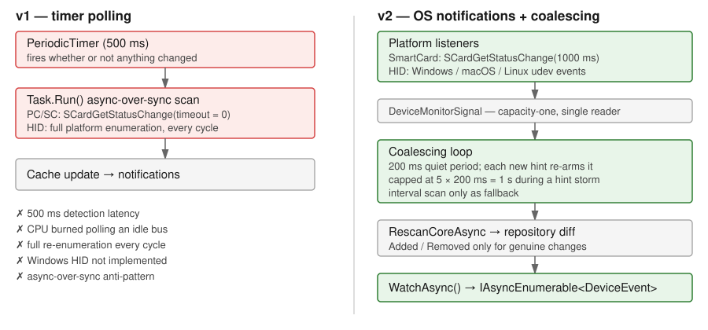

<!-- _class: lead -->

# YubiKit .NET **v2**

### A tour for people who live in the other SDKs

`yubikey-manager` · `yubikit-android` · `yubikit-swift` · `python-fido2`

<br>

- **Async on the golden path** — every applet operation is `async`; the few sync
  members that remain are deliberate lifecycle and transaction escapes
- **Install only what you use** — ten packages; all ten assemblies total 1.41 MiB
- **Native AOT** — 11.7 MiB resident, whole SDK linked
- **Event-driven discovery** — OS notifications, not a 500 ms polling timer
- **One session shape** — learn one applet, you know the rest

<br>

Branch `yubikit` @ `d04d59aa` · 2026-09-07


---

## Host App → SDK → Session → YubiKey


---

## The pipeline in code

```csharp
// 1. HOST APP asks the SDK for devices
var keys = await YubiKeyManager.FindAllAsync();

// 2. SDK returns IYubiKey handles
IYubiKey key = keys[0];

// 3. SESSION opened over a transport the SDK resolves
await using var piv = await key.CreatePivSessionAsync();

// 4. YUBIKEY executes; the session speaks the applet protocol
var cert = await piv.GetCertificateAsync(PivSlot.Authentication);
```

Every layer boundary is `async`. There is no synchronous escape hatch on the golden path.

<!-- Anchors: FindAllAsync src/Core/src/PublicAPI.Unshipped.txt:985;
     CreatePivSessionAsync src/Piv/src/IYubiKeyExtensions.cs:38;
     GetCertificateAsync src/Piv/src/PublicAPI.Unshipped.txt:191 -->


---

## Transports and interfaces


---

## Command invocation: smart card / APDU


PIV · OATH · OpenPGP · Management · SecurityDomain · YubiHSM Auth

---

## Command invocation: FIDO HID / CTAP


FIDO2 · WebAuthn. YubiOTP rides OTP-HID, a third framing.

---

## Applets are not one-transport-each

`[Flags] ConnectionType`: `Unknown=0` · `Hid=1` · `HidFido=2` · `HidOtp=4` · `SmartCard=8` · `All`

| Applet | Default transport order |
|---|---|
| **Management** | `SmartCard` → `HidFido` → `HidOtp` — **three** |
| **FIDO2** | `HidFido` → `SmartCard` |
| **WebAuthn** | inherits FIDO2's order |
| **YubiOTP** | `SmartCard` → `HidOtp` |
| PIV · OATH · OpenPGP · SecurityDomain · YubiHSM | `SmartCard` only |

- FIDO2's SmartCard path is **NFC, or USB-CCID on firmware 5.8.0+**.
- **YubiOTP prefers SmartCard**, not HID — on a CCID-enabled key the YubiOTP snippet
  later in this deck runs over APDU.
- Supplying `ScpKeyParameters` **forces SmartCard** when no preference is given.

```csharp
await using var mgmt = await key.CreateManagementSessionAsync(
    new SessionCreationOptions { PreferredConnectionType = ConnectionType.HidFido });
```

<!-- Anchors: Management src/Management/src/IYubiKeyExtensions.cs:143-144;
     Fido2 src/Fido2/src/IYubiKeyExtensions.cs:189-190, FW5.8 note :95;
     YubiOtp src/YubiOtp/src/IYubiKeyExtensions.cs:144-145;
     SCP-forces-SmartCard Management:109, Fido2:132, YubiOtp:110;
     single-transport Piv:46 Oath:47 OpenPgp:45 SecurityDomain:53 YubiHsm:49;
     ConnectionType src/Core/src/Devices/ConnectionType.cs:19-25 -->


---

## Device discovery


---

## Discovery API

```csharp
// Cached — the repository's current view
var keys = await YubiKeyManager.FindAllAsync();

// Force a fresh scan, or narrow by transport
var scan = await YubiKeyManager.FindAllAsync(
    ConnectionType.SmartCard, forceRescan: true);
```

Discovery is **publish-first and degraded-state tolerant** — a key is published as soon
as it is enumerated, even if its metadata read has not succeeded.

Canonical Rust instead withholds publication until metadata is read. That difference is
deliberate, and it is why `SerialNumber` can arrive late (next slide).

<!-- Anchors: PublicAPI.Unshipped.txt:984-985;
     docs/architecture/device-identity.md:93-96 -->


---

## Merging: one physical key, many interfaces

A single YubiKey appears as **several OS-level devices** — a PC/SC reader, a FIDO HID
device, an OTP HID device. The SDK merges them into one `IYubiKey`.

```
USB PC/SC reader  ─┐
FIDO HID device   ─┼─→  CompositeDeviceMerger  ─→  one IYubiKey
OTP HID device    ─┘
```

Merge inputs per interface: `Connection` · `IsUsb` · `Pid` · `Serial` · `DeviceInfo` ·
`TopologyKey` (Windows Container ID; `null` on macOS and Linux)

**NFC never merges.** Neither does a PC/SC reader of unknown kind — only USB-attached
interfaces are merge candidates. Correlation uses an internal, machine-local
interface-set key.

<!-- Anchors: src/Core/src/Devices/CompositeDeviceMerger.cs:19-30 (doc), :40-48 (descriptor);
     PhysicalIdentityKeyFor src/Core/src/Devices/YubiKeyDevice.cs:123,
     used YubiKeyDeviceRepository.cs:112 -->

---

## Identity: what is stable, what is not

| Surface | Guarantee |
|---|---|
| `DeviceId` | **Diagnostic only.** Not durable identity. |
| `SerialNumber` | Latched. `null` → value, **never** back to `null`. |
| Interface-set key | Internal, machine-local, never public |
| `Equals` / `GetHashCode` | **Referential** — same object, or not equal |

- `SerialNumber` may stay `null` **forever**: reads fail, budgets exhaust, and the
  Security Key series reports no serial at all.
- It can flip `null` → value **after** publication, with **no** device event.
- A key whose interface set changes is **republished as a new object** that inherits
  nothing from its predecessor.

> Full `DeviceInfo` stays internal: capabilities, flags and config are mutable via
> Management, so a cached copy goes stale. The serial is the one burned-in field.
> Need the rest? `await key.GetDeviceInfoAsync()` reads it live.

<!-- Anchors: device-identity.md D1 :61-65, D2 :67-98 (latch :76-77, null-forever :73-75,
     late arrival :80-81, republication :82-84), D6 :161, D7 :179;
     shortcut src/Management/src/PublicAPI.Unshipped.txt:33 -->


---

## Observability: the whole device-event API

```csharp
YubiKeyManager.StartMonitoring();                 // events don't flow until this

await foreach (var e in YubiKeyManager.WatchAsync())
{
    Console.WriteLine($"{e.Action}: {e.Device.DeviceId}");
}
```

```csharp
public enum DeviceAction { Added, Removed }
public class DeviceEvent { IYubiKey Device; DeviceAction Action; DateTime Timestamp; }
```

The monitoring **control** surface is five members: `StartMonitoring()`,
`StartMonitoring(TimeSpan)`, `StopMonitoring()`, `WatchAsync(ct)`, `IsMonitoring`.
`Shutdown()` / `ShutdownAsync()` also stop monitoring as part of tearing the manager down.
**No `IObservable`. No Rx dependency. BCL types only.**

<!-- Anchors: src/Core/src/PublicAPI.Unshipped.txt:986-992 (incl. Shutdown :987, ShutdownAsync :988);
     ShutdownAsync stops monitoring src/Core/src/Devices/YubiKeyManager.cs:216;
     src/Core/src/DeviceEvent.cs:19-30; docs/usage/device-discovery.md:126 -->

---

## How the peers surface device changes

| SDK | Attach / detach |
|---|---|
| **.NET v2** | `await foreach WatchAsync()` — OS-notification driven |
| `yubikey-manager` (Python) | **Poll only** — `scan_devices()` in a `sleep` loop |
| `yubikey-manager` (rust) | `monitor_yubikeys(cb)` — udev / `WM_DEVICECHANGE` / `IOHIDManager` |
| `yubikit-android` | Callbacks — `Callback<T>.invoke` attach, `setOnClosed` detach |
| `yubikit-swift` | **Connect-on-demand** — `makeConnection()` polls; `waitUntilClosed()` |
| `python-fido2` | **None** — `list_devices()` enumerates on call |

Two things worth noting: rust has a third variant, `YubiKeyEvent::Changed`, that .NET
does not. And Swift's `makeConnection()` is a 1-second poll loop internally, not an
OS notification.

<!-- Anchors: ykman ykman/device.py:108; rust monitor.rs:1113, examples/monitor_yubikeys.rs:87;
     android YubiKitManager.java:82-84, UsbYubiKeyDevice.java:154;
     swift@1.4.0 Connection.swift:32, USBSmartCardConnection.swift:53-55;
     python-fido2 fido2/hid/__init__.py:275-278 -->


---

## Observability: what changed underneath



<!-- Anchors: docs/architecture/event-driven-device-discovery.md;
     ThrottleInterval=200ms src/Core/src/Devices/YubiKeyDeviceMonitorService.cs:61;
     MaxCoalesceInterval=5x :66; interval fallback :579-580 -->

---

## Observability: three contracts worth knowing

**1 — `WatchAsync` subscribes on first iteration, not when called.**
Start the `await foreach` *before* the action you expect to trigger an event, or you
will miss anything raised in the gap.

**2 — Overflow faults the stream; it does not drop.**
Each enumeration owns a 256-event buffer. Overflow throws `InvalidOperationException`
on *that* stream only. Device events are **deltas**, so a silent drop would
desynchronise you — recover by re-enumerating and calling `FindAllAsync`.

**3 — `StartMonitoring(interval)` while already running is a silent no-op.**
The new interval is ignored, not applied, and no error is raised. Stop and start to
change it. Deliberate: partial application would be worse, and throwing would make an
idempotent start unsafe to call defensively.

> Logging is opt-in and static: `YubiKitLogging.Configure(loggerFactory)`, one line,
> before you touch the SDK. **Never inject `ILogger`** — that house rule is what keeps
> the SDK usable without a DI container.

<!-- Anchors: WatcherBufferCapacity=256 src/Core/src/Devices/DeviceEventHub.cs:51,
     overflow :242; subscribe-on-first-iteration docs/usage/device-discovery.md:90-92;
     StartMonitoring no-op src/Core/src/Devices/YubiKeyDeviceMonitorService.cs:296-303;
     logging docs/LOGGING.md:5-14, :219 -->


---

## Going below the applet API: three tiers

| Tier | What it gives you | What you take on |
|---|---|---|
| **0 — Applet session** | applet semantics, feature gates, protocol state | nothing |
| **1 — Raw session** | APDU/CTAP framing, chaining, overlap refusal, SCP | payload semantics |
| **2 — Raw connection** | a pipe | *everything* |

```csharp
await using var piv  = await key.CreatePivSessionAsync();           // Tier 0
await using var raw  = await key.CreateRawSmartCardSessionAsync();  // Tier 1
await using var conn = await key.ConnectAsync<ISmartCardConnection>();
var rsp = await conn.TransmitAndReceiveAsync(rawBytes);             // Tier 2
```

Tier 1 does **not** select an applet or apply feature gates. At Tier 2 you own APDU
formatting, chaining, response correlation, CRC validation, keep-alive, sequencing, and
recovery from partial or cancelled exchanges.

Dropping a tier does **not** drop transport safety — raw sessions still obey
one-connection-per-key and one-session-per-connection.

> This is the supported answer for teammates hand-rolling APDUs in `ykman` today:
> there is a place to do that, and it is Tier 1, not Tier 2.

<!-- Anchors: docs/architecture/raw-access-tiers.md:6-16 (T0), :19-33 (T1),
     :136-145 (T2), :30-33 (safety still applies);
     src/Core/src/Devices/YubiKeyConnectionExtensions.cs:37,90,108;
     Tier 2 signature takes ReadOnlyMemory<byte> src/Core/src/PublicAPI.Unshipped.txt:655
     (Tier 1 takes ApduCommand, :535) -->


---

## One session shape — for eight of the nine

```csharp
await using var s = await key.CreateXSessionAsync(options, cancellationToken);
```

- A sealed `XSession` plus a matching `IXSession` interface
- `IYubiKey.CreateXSessionAsync(...)` — session owns a hidden connection
- `XSession.CreateAsync(connection, ...)` — session borrows yours
- Both take `SessionCreationOptions?` then a defaulted `CancellationToken`
- Always `await using`

**Test-enforced, not conventional** — `AppletSessionShapeTests` enumerates the eight
sessions and asserts the shape holds for each.

> **WebAuthn is the deliberate exception.** It is not an applet session. It returns a
> `WebAuthnClient`, takes a required origin and public-suffix checker, and has its own
> factory test. The test file says so in as many words:
> *"WebAuthn is not an applet session and has its own factory test."*

<!-- Anchors: grammar docs/architecture/applet-public-api.md:3-9;
     eight sessions src/PublicApi/tests/.../AppletSessionShapeTests.cs:16-26;
     exclusion FactoryShapeTests.cs:56, WebAuthn factory shape :94-127 -->

---

## Ownership: who disposes the connection

```csharp
// Convenience — the session owns a hidden connection and disposes it
await using var piv = await key.CreatePivSessionAsync();
```

```csharp
// Direct factory — you own the connection, you dispose both
await using var conn = await key.ConnectAsync<ISmartCardConnection>();
await using var mgmt = await ManagementSession.CreateAsync(conn);
var info = await mgmt.GetDeviceInfoAsync();
```

**One key admits one live connection. One connection admits one live session** —
a second `Attach` throws `ConnectionInUseException`. Dispose session N before creating
N+1 over the same connection. Prefer `DisposeAsync`; sync `Dispose` blocks to drain.

| SDK | Who owns the connection |
|---|---|
| **.NET v2** | Both, named explicitly at the call site |
| ykman (Python) | Caller — `with dev.open_connection(...)` |
| ykman (rust) | Session **consumes** it; returns `(Error, Connection)` on failure |
| yubikit-android | Session borrows, but `close()` closes the connection too |
| yubikit-swift | Caller owns; session never closes it |

<!-- Anchors: real call site src/Management/tests/.../ManagementSessionSimpleTests.cs:40-43;
     OwnConnection src/Piv/src/IYubiKeyExtensions.cs:59;
     rules docs/architecture/raw-access-tiers.md:149-152,158-159;
     enforcement src/Core/src/Sessions/ConnectionSessionGuard.cs:44-52;
     peers: python yubikit/core/__init__.py:182; rust management.rs:34;
     android SmartCardProtocol.java:125-127; swift@1.4.0 PIVSession.swift:67 -->


---

## Management

Read device info, toggle capabilities, write device config.

```csharp
var info = await key.GetDeviceInfoAsync();   // no session needed
```

<div class="cols">

**ykman (Python)**
```python
mgmt = ManagementSession(conn)
info = mgmt.read_device_info()
```

**yubikit-swift**
```swift
let s = try await Management.Session.makeSession(connection: connection)
let info = try await s.getDeviceInfo()
```

</div>

**Delta:** .NET gives Management a device-level shortcut — no session boilerplate for the
most common read. It is also the widest applet: three transports, `SmartCard → HidFido →
HidOtp`. Swift covers two, with `SmartCardConnection` and `FIDOConnection` overloads.

<!-- Anchors: .NET shortcut src/Management/src/PublicAPI.Unshipped.txt:33,
     transports src/Management/src/IYubiKeyExtensions.cs:143-144;
     python yubikit/support.py:83, yubikit/management.py:598;
     swift@1.4.0 ManagementSession.swift:142 (SmartCard), :159 (FIDO), :72 -->

---

## PIV

Certificates, key pairs, PIN/PUK, attestation.

```csharp
await using var piv = await key.CreatePivSessionAsync();
var cert = await piv.GetCertificateAsync(PivSlot.Authentication);
```

<div class="cols">

**ykman (Python)**
```python
piv = PivSession(conn)
cert = piv.get_certificate(SLOT.AUTHENTICATION)
```

**yubikit-android**
```java
PivSession piv = new PivSession(smartCardConnection);
X509Certificate cert = piv.getCertificate(Slot.AUTHENTICATION);
```

</div>

**Delta:** all three return a real certificate type — `X509Certificate2`,
`x509.Certificate`, `java.security.cert.X509Certificate`. The .NET difference is
**nullability**: an empty slot returns `null` rather than throwing.

<!-- Anchors: .NET src/Piv/src/IYubiKeyExtensions.cs:38,
     PublicAPI.Unshipped.txt:191 (X509Certificate2?);
     python yubikit/piv.py:1258; android PivSession.java:882 -->

---

## OATH

TOTP and HOTP credentials, calculate codes, applet password.

```csharp
await using var oath = await key.CreateOathSessionAsync();
var codes = await oath.CalculateAllAsync();
```

<div class="cols">

**ykman (Python)**
```python
oath = OathSession(conn)
creds = oath.list_credentials()
```

**yubikit-android**
```java
OathSession oath = new OathSession(conn);
Map<Credential, @Nullable Code> codes = oath.calculateCodes();
```

</div>

**Delta:** the closest convergence in the deck — .NET's
`IReadOnlyDictionary<Credential, Code?>` and Android's `Map<Credential, @Nullable Code>`
express the same touch-required semantics. .NET makes it a compiler-enforced `Code?`
rather than an annotation.

<!-- Anchors: .NET src/Oath/src/IYubiKeyExtensions.cs:39,
     PublicAPI.Unshipped.txt:50,87; python yubikit/oath.py:265,447;
     android OathSession.java:391 -->


---

## OpenPGP

Card data, key slots, sign / decrypt / authenticate, PIN management.

```csharp
await using var pgp = await key.CreateOpenPgpSessionAsync();
var data = await pgp.GetApplicationRelatedDataAsync();
```

<div class="cols">

**ykman (Python)**
```python
pgp = OpenPgpSession(conn)
data = pgp.get_application_related_data()
```

**yubikit-android**
```java
OpenPgpSession pgp = new OpenPgpSession(conn);
ApplicationRelatedData d = pgp.getApplicationRelatedData();
```

</div>

**Delta:** `yubikit-swift` has **no OpenPGP session at all** — only a `Capability.openPGP`
bit. If you work in Swift, this applet is entirely new to you.

<!-- Anchors: .NET src/OpenPgp/src/IYubiKeyExtensions.cs:37,
     PublicAPI.Unshipped.txt:181; python yubikit/openpgp.py:987,1088;
     android OpenPgpSession.java:154,266; swift@1.4.0 absent, Capability.swift:24 -->

---

## FIDO2 — the CTAP2 layer

Raw CTAP2: `GetInfo`, `MakeCredential`, `GetAssertion`, credential management, bio.

```csharp
await using var fido = await key.CreateFidoSessionAsync();
var info = await fido.GetInfoAsync();
```

<div class="cols">

**python-fido2**
```python
ctap2 = Ctap2(dev)
info = ctap2.info      # cached at construction
```

**yubikit-swift**
```swift
let s = try await CTAP2.Session.makeSession(connection: connection)
let info = try await s.getInfo()
```

</div>

**Delta:** `python-fido2` runs `GET_INFO` **inside the constructor** and caches it; .NET
keeps construction cheap and the round-trip explicit and cancellable. Note FIDO2 is
dual-transport: `HidFido` first, then SmartCard — NFC, or USB-CCID on **firmware 5.8.0+**.

<!-- Anchors: .NET src/Fido2/src/IYubiKeyExtensions.cs:124,
     PublicAPI.Unshipped.txt:609, transports :189-190, FW5.8 :95;
     python-fido2 fido2/ctap2/base.py:246-262 (get_info at :252), :304-309;
     swift@1.4.0 CTAPSession+Creation.swift:25, CTAPSession.swift:49 -->

---

## WebAuthn — the layer above CTAP2

Origin checks, client data, attestation, extensions, PIN/UV orchestration.

```csharp
_ = WebAuthnOrigin.TryParse("https://example.com", out var origin);
await using var client = await key.CreateWebAuthnClientAsync(
    origin!, isPublicSuffix: d => d is "com" or "org" or "net");
var reg = await client.MakeCredentialAsync(options, pinBytes);
```

<div class="cols">

**python-fido2**
```python
result = client.make_credential(create_options["publicKey"])
```

**yubikit-swift** *(release/1.4.0)*
```swift
let client = WebAuthn.Client(session: session, origin: try .init("https://example.com"),
                             isPublicSuffix: { publicSuffixList.contains($0) })
let r = try await client.makeCredential(options, authorization: .pin("1234")).value
```

</div>

**Delta:** both .NET and Swift demand an **origin and a public-suffix checker up front** —
you cannot accidentally skip origin validation. `python-fido2` also ships the
relying-party half (`Fido2Server`); v2 is client-side only.

<!-- Anchors: .NET src/WebAuthn/src/IYubiKeyExtensions.cs:57-62,
     PublicAPI.Unshipped.txt:111-112, real call site
     src/WebAuthn/tests/.../WebAuthnClientFactoryTests.cs:42-45;
     python-fido2 fido2/client/__init__.py:1066-1179, fido2/server.py:158;
     swift@1.4.0 FIDO/WebAuthn/Client/Client.swift:34-41 (doc), :95 (init) -->


---

## SecurityDomain (SCP)

GlobalPlatform key management — SCP03 and SCP11, certificates, CA identifiers.

```csharp
await using var sd = await key.CreateSecurityDomainSessionAsync();
var certs = await sd.GetCertificatesAsync(keyReference);
```

<div class="cols">

**ykman (Python)**
```python
sd = SecurityDomainSession(conn)
keys = sd.get_key_information()
```

**yubikit-swift**
```swift
let s = try await SecurityDomainSession.makeSession(connection: connection)
let keyInfo = try await s.getKeyInformation()
```

</div>

**Delta:** in .NET, SCP is *also* a creation option on every other applet — pass
`SessionCreationOptions { ScpKeyParameters = ... }` and any session runs over a secure
channel. Supplying it without a transport preference **forces SmartCard**.

<!-- Anchors: .NET src/SecurityDomain/src/IYubiKeyExtensions.cs:45,
     PublicAPI.Unshipped.txt:22; SCP-as-option
     src/Management/tests/.../ManagementSessionSimpleTests.cs:215-217,
     SCP-forces-SmartCard src/Management/src/IYubiKeyExtensions.cs:109;
     python yubikit/securitydomain.py:100,122;
     swift@1.4.0 SecurityDomainSession.swift:55,124 -->

---

## YubiHSM Auth

Store and use credentials that authenticate to a YubiHSM 2.

```csharp
await using var hsm = await key.CreateHsmAuthSessionAsync();
var creds = await hsm.ListCredentialsAsync();
```

<div class="cols">

**ykman (Python)**
```python
hsm = HsmAuthSession(conn)
creds = hsm.list_credentials()
```

**ykman (rust)**
```rust
let mut s = HsmAuthSession::new(conn).map_err(|(e, _)| e)?;
let creds = s.list_credentials()?;
```

</div>

**Delta:** only .NET, Python and rust implement this. `yubikit-android` has **no**
YubiHSM Auth module; `yubikit-swift` has only the `Capability.hsmAuth` bit.

<!-- Anchors: .NET src/YubiHsm/src/IYubiKeyExtensions.cs:41,
     PublicAPI.Unshipped.txt:36; python yubikit/hsmauth.py:223,250;
     rust crates/yubikit/src/hsmauth.rs:32,383;
     android absent settings.gradle.kts:35-39; swift@1.4.0 absent Capability.swift:30 -->

---

## YubiOTP

The two programmable slots — Yubico OTP, static password, HMAC-SHA1 challenge-response.

```csharp
await using var otp = await key.CreateYubiOtpSessionAsync();
var serial = await otp.GetSerialNumberAsync();
```

<div class="cols">

**ykman (Python)**
```python
otp = YubiOtpSession(conn)
state = otp.get_config_state()
```

**yubikit-android**
```java
YubiOtpSession otp = new YubiOtpSession(otpConnection);
byte[] r = otp.calculateHmacSha1(Slot.TWO, challenge, null);
```

</div>

**Delta:** despite the name, .NET's YubiOTP session is **dual-transport and prefers
SmartCard** — `SmartCard → HidOtp`. On a CCID-enabled key the snippet above runs over
APDU, not HID. `yubikit-swift` has no YubiOTP slot session at all.

<!-- Anchors: .NET src/YubiOtp/src/IYubiKeyExtensions.cs:102,
     transport order :144-145, PublicAPI.Unshipped.txt:166;
     python yubikit/yubiotp.py:708,779; android YubiOtpSession.java:253,447;
     swift@1.4.0 absent Capability.swift:20 -->


---

## Applet coverage across the SDKs

| Applet | .NET v2 | ykman (py) | ykman (rust) | android | swift |
|---|:--:|:--:|:--:|:--:|:--:|
| Management | ✅ | ✅ | ✅ | ✅ | ✅ |
| PIV | ✅ | ✅ | ✅ | ✅ | ✅ |
| OATH | ✅ | ✅ | ✅ | ✅ | ✅ |
| OpenPGP | ✅ | ✅ | ✅ | ✅ | ❌ |
| FIDO2 / CTAP2 | ✅ | ➡️ | ✅ | ✅ | ✅ |
| WebAuthn | ✅ | ➡️ | ✅ | ✅ | ✅ |
| SecurityDomain | ✅ | ✅ | ✅ | ✅ | ✅ |
| YubiHSM Auth | ✅ | ✅ | ✅ | ❌ | ❌ |
| YubiOTP | ✅ | ✅ | ✅ | ✅ | ❌ |

➡️ = not implemented in-repo; delegated to **`python-fido2`**, a hard dependency
(`fido2 >=2.0,<3`). That library supplies both `Ctap2` and `Fido2Client` — and, uniquely,
`Fido2Server`, the relying-party half no other SDK here ships.

**.NET v2 and the rust experiment are the only two with all nine in one repo.**

<!-- Anchors — rust @90940e9 crates/yubikit/src/: management.rs, piv.rs, oath.rs,
     openpgp.rs, ctap2/mod.rs, webauthn/client.rs, securitydomain.rs, hsmauth.rs,
     yubiotp.rs (all verified present).
     android @f462685: SecurityDomainSession core/.../smartcard/scp/,
     WebAuthnClient fido/.../client/, YubiHSM absent settings.gradle.kts:35-39.
     swift @c76ae973 release/1.4.0: OpenPGP/YubiHSM/YubiOTP absent,
     Capability.swift:24,30,20 carry only the bits.
     python @4ca60f7: delegation ykman/diagnostics.py:207, dependency pyproject.toml:21;
     python-fido2 @5bc9d3a Ctap2 ctap2/base.py:246, Fido2Client client/__init__.py:1066,
     Fido2Server server.py:158. -->


---

## Footprint: what you ship

**Managed assemblies** (Release, `net10.0`) — install only what you use:

| Assembly | KiB | | Assembly | KiB |
|---|--:|---|---|--:|
| Core | 577 | | WebAuthn | 130 |
| Fido2 | 197 | | OpenPgp | 110 |
| Piv | 165 | | Oath | 62 |
| SecurityDomain | 56 | | YubiOtp | 56 |
| YubiHsm | 51 | | Management | 37 |

**All ten: 1,441 KiB = 1.41 MiB.** A PIV-only app pays Core + Piv = **742 KiB**.

*These are assembly sizes from `bin/Release/net10.0`, not `.nupkg` sizes.*

**Native AOT**, verification host linking all ten libraries:

| | Native AOT | Framework-dependent |
|---|--:|--:|
| Executable | **3.11 MiB** | — |
| NativeShims sidecar | 3.71 MiB | 3.71 MiB |
| **Peak RSS** | **11.7 MiB** | 51.5 MiB → **4.4× less** |
| **CPU (user + sys)** | **~20 ms** | ~170 ms |
| Wall, median of 10 | 528 ms | 628 ms |

---

## Footprint: how these were collected

**Machine.** Apple M1, 8 cores, 16 GB, macOS 15.7.7, .NET SDK 10.0.100, RID `osx-arm64`.
Repo @ `d04d59aa`. **6 YubiKeys physically attached.**

| Number | Provenance |
|---|---|
| Assembly sizes | **Measured** — `stat` on `bin/Release/net10.0/*.dll` |
| AOT exe, RSS, CPU, wall | **Measured** — `dotnet publish -r osx-arm64 -p:PublishAot=true` of `verification/NativeAotVerification`; `/usr/bin/time -l`; wall = median of 10 after 3 warm-ups; RSS and CPU from a single representative run |
| Framework-dependent baseline | **Measured** — same project, `-p:PublishAot=false --self-contained false` |
| AOT link coverage, support contract | **Quoted** — PR #578, `docs/NATIVE-AOT.md` |
| Recurring AOT CI | **CI** — `native-aot.yml` run `34121554932` on `yubikit`, macOS arm64, **hardware-free** (asserts `Found 0 YubiKey(s)`) |

⚠️ **Two caveats.** Wall time is dominated by I/O enumerating six attached keys, not by
startup: subtracting CPU leaves **508 ms** (AOT) and **458 ms** (framework-dependent) of
non-CPU time — same order, ~11 % apart, and both far larger than either CPU figure.
Second, `/usr/bin/time -l` quantises CPU to 10 ms, so "20 ms vs 170 ms" is two ticks
against seventeen: **treat the CPU ratio as "roughly an order of magnitude", not 8.5×.**

BenchmarkDotNet throughput and allocation were **not collected** — the project does not
compile at this SHA (`DEFERRED.md` #1). Single machine, single run set: **ballpark**.


---

<!-- _class: lead -->

## Takeaways

**One shape, eight applet sessions** — test-enforced, not conventional.
WebAuthn is the deliberate exception: it returns a client, not a session.

**Ownership is explicit.** Convenience owns the connection, the direct factory borrows it.
One connection, one live session, enforced at runtime.

**Device events are one API.** `StartMonitoring()` + `await foreach WatchAsync()`.
No Rx, no `IObservable`, BCL types only.

**Identity is honest about what it cannot promise.** `DeviceId` is diagnostic;
`SerialNumber` may be `null` forever and can arrive late without an event.

**AOT is real.** 11.7 MiB resident with the whole SDK linked, ~4.4× less than JIT.

<br>

`docs/architecture/` · `docs/usage/device-discovery.md` · `docs/NATIVE-AOT.md`
Status **2.0.0-alpha.2** — public API still in `PublicAPI.Unshipped.txt`, so breaking
changes are still cheap. Now is the time to complain.

<!-- Anchors: eight sessions AppletSessionShapeTests.cs:16-26;
     version Directory.Packages.props:6; all other claims anchored on their own slides -->

<script src="assets/vendor/panzoom.min.js"></script>
<script src="assets/deck-zoom.js"></script>
