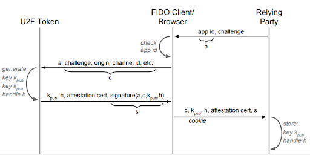
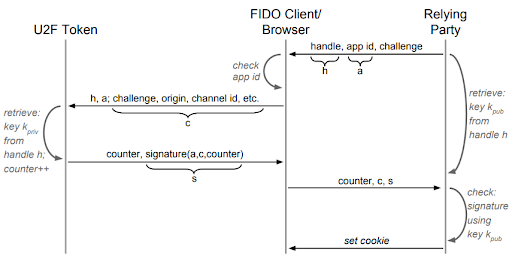

<!-- Copyright 2021 Yubico AB

Licensed under the Apache License, Version 2.0 (the "License");
you may not use this file except in compliance with the License.
You may obtain a copy of the License at

    http://www.apache.org/licenses/LICENSE-2.0

Unless required by applicable law or agreed to in writing, software
distributed under the License is distributed on an "AS IS" BASIS,
WITHOUT WARRANTIES OR CONDITIONS OF ANY KIND, either express or implied.
See the License for the specific language governing permissions and
limitations under the License. -->

# How FIDO U2F works

At its foundation, there are two FIDO U2F operations:

- Registration
- Authentication

First, the user registers the YubiKey and ties it to a particular account.

Second, when logging on, the user makes sure the appropriate YubiKey is inserted. During
login, the YubiKey, browser, and authentication server will communicate and perform the
steps necessary to authenticate. The user will likely need to tap the YubiKey in order to
complete authentication.

This article describes what is happening "under the covers" during registration and
authentication.

## The entities involved

There are three components in FIDO U2F

- The authenticator (YubiKey)
- The client (a browser, platform component, or application)
- The relying party (verifies the authentication process)

FIDO U2F can only work when using clients that already have support. For example, suppose
you have an online account with a bank and you have added FIDO U2F support. Now you try to
log into that account using a Vivaldi or Puffin browser on MacOS. That might not work
because it is possible those browsers do not support FIDO U2F. You can log in using Safari
or Chrome, because they do have support.

The client is, of course, the "medium" through which the authenticator and relying party
communicate. However, the client also plays a role in verifying that the relying party is
correct, not a fake or attacker.

## Registration

The goal of registration is for the authenticator to provide a public key and a handle to
the partner private key to the relying party. This key and handle are to be associated
with an account. Also associated with the account is a counter. The relying party will
initialize the stored counter to zero.

Next, the client provides "origin data" to the authenticator. This is data the
authenticator will use during authentication. If the origin data during authentication
does not match the origin data from registration, then the authenticator will return an
error.

Finally, the relying party provides an "AppId" to the authenticator. See
[this description](https://developers.yubico.com/U2F/App_ID.html) for more details on
AppIds. For now, an AppId is a list of trusted facets, where we can think of a facet as a
description of a FIDO U2F "entry point". This could be the the URL of the login page,
among other things.

Generally, an authentication server will have a database of accounts, each entry
containing a username and password info (not the password itself, but information that can
be used to verify the password). With FIDO U2F, each entry will also contain a public key,
a private key handle, and a counter.

First, let's look at the flow diagram describing U2F registration.



### Step 0

The user has logged in to an account and is now adding U2F, or this is happening during
account registration.

### Step 1

The relying party sends to the client a random value, called the challenge. The relying
party also sends the "AppId".

Although it can be more complicated, think of the AppId as either a single URL or else a
set of URLs. The client will look at who it is actually connected to (called the "origin")
and see if that URL is on the list. If not, there is a mismatch and the connection is
dropped.

### Step 2

The client builds a message containing the digest of the origin and the digest of the
challenge data. The origin is who the client is actually connected to, and the challenge
data includes the challenge, of course, but also the origin (again), and possibly some TLS
information. This information is sent to the authenticator (Yubikey).

Note that the terminology can change, even inside the standard. There's the origin, which
is something the client creates. It creates a string that includes the protocol, hostname,
and port of the actual connection. Next is the "application identifier" or "appId". It is
the value the relying party sends to the client. It will presumably be the same as the
origin. Then there is a "facet ID", which is a single "entry point" to the relying party.
Some relying parties can have multiple facets (e.g. one for web, one for iOS, and one for
Android).

The client will be able to compare the origin it computes with the facet ID or app ID the
relying party sends.

Finally, there is the digest of the origin, computed by the client. It is sometimes called
the "appIdHash", or "origin data", or the "application parameter". For example, one part
of the U2F standard uses the term "hash of the origin". However, the part of the standard
that specifies how messages are formatted uses the term "application parameter".

The following is the message sent by the client to the YubiKey, initiating registration.

```txt
    challenge parameter || application parameter
```

The "challenge parameter" is also known as "client data hash". The client computes the
SHA-256 digest of the challenge, origin, and other information.

The "application parameter" is also known as "hash of the origin", or "appIdHash", or
"origin data". The client computes the SHA-256 digest of the origin it computed.

For example, in hex

```txt
  A76CF9A4BDA5D0596D56612E71CDD954C38168954541522F7DCD9433666BA0F008D71B87CC11BF231245CC8C0A1B653FB5A47C2D9D66A8B94154AAB26C2FF670

 The challenge data is  A76CF9A4BDA5D0596D56612E71CDD954C38168954541522F7DCD9433666BA0F0
    The origin data is  08D71B87CC11BF231245CC8C0A1B653FB5A47C2D9D66A8B94154AAB26C2FF670
```

### Step 3

The authenticator generates a new ECC key pair (using a standard EC parameter set
specified by the FIDO U2F specifications). If the authenticator wants, it can use the
information in the origin data as input to the key pair generation process. In fact, the
Yubikey performs HMAC on the origin data, using an HMAC key derived from the
[FIDO U2F master key](#fido-master-key) to generate the key pair. Note that the master key
is in the secure element and never leaves the YubiKey.

The authenticator generates a different key pair for each site with which it registers.

The private key is never to leave the device in the clear. In order to find the
appropriate private key later, the authenticator creates a handle. This can be anything
that the authenticator wants, just so long as it is a way for the device to recall that
specific private key when needed. For example, it could be a number, whereby a device
numbers all its keys starting with 1. When presented with a handle, retrieve the key
associated with that number.

Whatever the handle, it must somehow contain the origin data.

With the Yubikey, the handle is the key itself, along with the origin data, encrypted
using an AES key derived from the [FIDO U2F master key](#fido-master-key). Later on, when
presented with the handle, the Yubikey decrypts it and has the private key and correct
origin data. Someone outside can see the handle, and know that it contains the private key
itself. So all they have to do is decrypt it. But they don't know the key-encrypting-key,
so they must perform a brute-force attack, which would take trillions of years.

The authenticator now creates a message (sent to the client) containing the public key,
the private key handle, and an [attestation cert](#attestation), then signs it using the
attestation private key.

```txt
    marker byte || public key || key handle || attestation cert || signature
```

For example, in hex

```txt
    05 045827...A4 86149D...7B 308202D8...19 30440220...2C
        pub key   |  handle   |     cert    |   signature |
```

For a deeper discussion of attestation, see [the section below](#attestation).

### Step 4

The client forwards the authenticator's message to the relying party, which verifies the
signature and attestation cert. It now knows that the private key partner to the public
key in the message was indeed generated by a YubiKey.

The relying party stores the public key, private key handle, and an initial counter of
zero in the user's database entry.

## Authentication

The goal of authentication is for the authenticator to send, to the relying party, a value
that proves the authenticator is the one registered to the specified user.

In addition, the authenticator, working with the client, can verify the current origin
(who the client is actually connected to) is the correct one.

First, let's look at the flow diagram describing U2F registration.



### Step 1

The relying party sends a random challenge (a new one each time), the AppId, and the
private key handle to the code running on the client. This login code now calls on the
client's U2F Javascript API for authentication.

### Step 2

The client builds the origin data, then sends it along with the challenge, and key handle
to the authenticator.

```txt
    control byte || challenge parameter || application parameter || key handle
```

For example, in hex

```txt
    03 50F2A8...37 08D71B...70 86149D...7B
      | challenge |origin data|  handle   |
```

The challenge parameter is not the same one from registration. It is the digest of a new
challenge, along with much of the same data used during registration. The origin data
(application parameter) is the same from registration. The handle is the same from
registration.

### Step 3

The authenticator uses the origin data and key handle from the client to find and retrieve
the appropriate key. If it determines that the origin data provided during authentication
does not match the origin data from registration, or more likely, it simply cannot find a
key associated with the key handle and origin data, it will return an error.

If the origin data matches, the authenticator increments its counter and signs the
challenge parameter, application parameter (origin data), counter, and a byte indicating
whether the user tapped the YubiKey. The counter and signature are sent to the client.

The YubiKey has a single counter for all U2F sites (explicitly allowed by the standard),
so the initial counter for a new registration might be 0, or it might be greater than
zero.

### Step 4

The client sends the counter, challenge, and signature to the relying party, which
verifies the signature using the public key (likely stored in the username/password
database). It also verifies that the counter is greater than the last authentication.

## Why This Works

We want a system that verifies the user, and gives the user confidence that they are
logging into the actual site. How does this system accomplish that?

First, let's look at how this proves to the relying party that the user does indeed have
access to the authenticator. Next, we'll look at how the user can have confidence that
they are indeed logging into the intended site.

### Validating the User

First of all, the U2F authentication only verifies that the authenticator was used. If an
attacker steals a user's Yubikey, they can use it and the relying party has no way of
knowing that the correct user is not on the other end. Of course, the attacker must also
have the user's password. Hence the "2" of U2F, indicating a second factor authentication.

Once the relying party has the user's public key, they can verify any signature. Only the
Yubikey can create valid signatures that the user's public key will verify, so that the
relying party knows that the user's Yubikey created that signature.

To break the system, the attacker would have to break ECC (compute the private key based
on a public key and/or some set of signatures), or break the Yubikey (obtain the master
key off the secure element).

Another attack would be "replay". Collect a valid signature and in another session, pass
it off as a new one. But signatures are based on the challenge (the smart relying party
will make sure that is different every single session) and the counter. So an old
signature won't be valid anymore.

### Validating the relying party

One of the most important reasons for using this form of two-factor authentication is to
thwart the "man-in-the-middle" attack. Here's how that usually works with a
username/password system.

The attacker uses a phishing email to get you to click on a link. You click and up pops
your browser showing a site that looks just like a legitimate login page. But it's not, it
is the attacker's site.

When you enter your username and password, the bad site simply passes that information on
to the real site. If it is correct, the attacker now has opened your account. They pass
the opened pages on to you. You perform the operation and log out. The attacker has not
done any processing, it simply takes any information you entered and passes it on to the
real website, and takes any returned information and passes it on to you. They see
everything, so they have your username and password and all the information in the pages
you opened.

Now look at the target site with U2F. Suppose you click on the link in a phishing email.
You see the login page. You enter your username and password, which the bad site passes on
to the real one. However, now the real site needs the U2F authentication. It sends the
auth message (step 1) to the bad site, which passes it on to you.

But when it is passing it on to you, it is passing it on to the client, the browser. The
client computes the origin data, which in this case is the bad site. The client sends the
challenge, key handle, and origin data to the authenticator, which can see the mismatch
between the current origin data and what is in the key handle. It will return an error and
the client can drop the connection. The bad site collected your username and password, but
could not log in to your account. They now need to steal your Yubikey to break into your
account.

Note that the U2F standard specifies that the key pair is generated using the origin data
and "...the U2F device encodes the requesting origin into the Key Handle." Because the key
handle includes the origin data, it will be possible for the authenticator to see the
mismatch between the origin data and the key handle.

The YubiKey builds a key handle by encrypting the private key and origin data using the
[FIDO U2F master key](#fido-master-key). This means the attacker will not be able to build
an alternate key handle.

And even if the attacker is able to somehow get the authenticator to compute a signature,
the relying party will not authenticate it. That's because the data to sign includes the
origin data. The relying party will try to verify the signature using the challenge along
with its origin data. However, the authenticator built the signature using the challenge
and the atacker's origin data.

Incidentally, it would probably be a good idea to collect the username, then perform U2F,
and only after that was successful collect the password.

## FIDO master key

A YubiKey is manufactured with a FIDO master key. Each YubiKey has a different master key.
It resides in the secure element so never leaves the device. It is possible to reset the
FIDO U2F application on a YubiKey, and when that happens, the old master key is replaced
with a newly-generated value. In this case, all old credentials are lost.

During FIDO U2F operations, the YubiKey will use the master key to generate the key pair
and encrypt the private key. It does this by using the master key as a starting point and
deriving values from it. That is, the input is the master key and other data (such as a
descriptor indicating the use case, or origin data), and the output is the actual key to
use. In this way, only one key is saved in the secure element, yet there can be many
different secure keys.

## Attestation

During registration, the YubiKey will send the public key and partner private key handle
to the relying party (via the client). At this point, the relying party wants to know that
the public key came from a YubiKey, and not a software implementation. This is proven
using attestation.

Each YubiKey contains a FIDO U2F attestation private key and cert installed during
manufacture. The private key is loaded into the secure element and cannot leave the
device. The same private key and cert are installed on thousands of YubiKeys.

The registration information the YubiKey sends to the relying party includes the public
key and handle, of course, but it also includes the attestation cert and a signature.

The YubiKey will create data to sign that includes the digest of the origin, the client
data hash (the digest of a JSON structure containing the challenge, origin data, and other
information) along with the public key and key handle. This data is signed using the
attestation private key. This signature is an attestation statement. An entity verifying
the signature can see there is a binding between the relying party (represented by the
origin and client data), this registration (represented by the challenge), and the
YubiKey (represented by the public key).

The relying party knows that the signature was created by the YubiKey's attestation
private key because it verifies using the attestation cert. To verify the signature, the
relying party extracts the public key from the cert and performs normal verification. It
then verifies the cert by chaining to a root.

Any relying party that wants to support U2F will obtain root certs for all the devices it
is willing to support.

```txt
                        Root Cert
                            |
                            |
                     Attestation Cert
        (Sent in the registration response message)
                            |
                            |
                  Attestation Statement
  (the signature in the resgistration response message)
```

It is possible to create an attestation statement for the FIDO U2F private keys generated
on a YubiKey. Such a statement simply offers evidence that a private key was generated on
a YubiKey. It does not say anything about who owns the YubiKey, or who signed some data
using the private key, only that the key is from a YubiKey.

Note that any private key generated on the YubiKey, using the FIDO U2F application, is not
allowed to leave the device in the clear. Hence, it is possible to verify that a private
key operation was performed (or will be performed) by the YubiKey and only the YubiKey.

See also [this page](https://developers.yubico.com/U2F/Attestation_and_Metadata/) for
information on U2F attestation.

To verify the attestation cert, use the root certificate. You can find Yubico's U2F root
[here](https://developers.yubico.com/U2F/yubico-u2f-ca-certs.txt).
