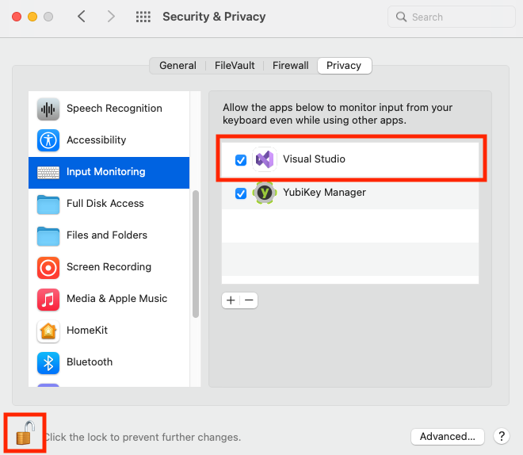

<!-- Copyright 2021 Yubico AB

Licensed under the Apache License, Version 2.0 (the "License");
you may not use this file except in compliance with the License.
You may obtain a copy of the License at

    http://www.apache.org/licenses/LICENSE-2.0

Unless required by applicable law or agreed to in writing, software
distributed under the License is distributed on an "AS IS" BASIS,
WITHOUT WARRANTIES OR CONDITIONS OF ANY KIND, either express or implied.
See the License for the specific language governing permissions and
limitations under the License. -->

# Making a connection

Before your application can call on the YubiKey to perform operations, it must connect to
the appropriate device.

There are generally two steps:

1: Find all YubiKeys available on the host machine and choose the one to use.

and either

2a: Create an instance of one of the "Session" classes (e.g. `PivSession`).

or

2b: Make a connection to that device through one of the YubiKey applications.

The vast majority of applications will use the "Session" classes. Anything you can do with
a connection (2b) you can do with a "Session" object (2a). However, early releases of the
SDK do not have "Session" classes for every application yet.

It is possible you want to perform some operation for which there is no "Session" class
yet, or maybe there is some reason you do not want to create a session. If so, there is
another way to make a connection.

## The class representing the hardware.

Each YubiKey available on the host machine can be represented by an instance of
`IYubiKeyDevice`. Because there can be more than one YubiKey available at any one time, you will
need to obtain a list. Use the [YubiKeyDevice](xref:Yubico.YubiKey.YubiKeyDevice) class.

> [!IMPORTANT]
> The enumeration methods are "best effort", which means they will attempt to return a set of
> `IYubiKeyDevice` objects even if errors are encountered with some devices. Therefore the
> number of `IYubiKeyDevice` objects returned by the enumeration methods may not equal the
> number of YubiKeys attached to the host machine.
>
> Complicating this is the fact that each physical YubiKey can look like one or more separate
> devices to the host machine. The enumeration method will do its best to find all of these
> devices, and match them back together using their serial number. If they can't be matched,
> they will be returned as separate `IYubiKeyDevice` objects.

```c#
// Chooses the first YubiKey found on the computer.
IYubiKeyDevice? SampleChooseYubiKey()
{
    IEnumerable<IYubiKeyDevice> list = YubiKeyDevice.FindAll();
    return list.First();
}
```

You can also find only those YubiKeys that support a particular transport protocol (e.g.
smart card for PIV), or you want to find only those YubiKeys inserted into a USB port
(as opposed to NFC).

```c#
// Chooses the first USB-based YubiKey that exposes Smart Card functionality.
IYubiKeyDevice? SampleChooseYubiKey()
{
    IEnumerable<IYubiKeyDevice> list = YubiKeyDevice.FindByTransport(Transport.UsbSmartCard);
    return list.First();
}
```

Now you can cycle through the list, obtaining information about each YubiKey to help
decide which to use.

```c#
IYubiKeyDevice? SampleChooseYubiKey()
{
    IEnumerable<IYubiKeyDevice> list = YubiKeyDevice.FindByTransport(Transport.UsbSmartCard);

    foreach (IYubiKeyDevice currentYubiKey in list)
    {
        if (currentYubiKey.FirmwareVersion.Major < 5)
        {
            continue;
        }

        return currentYubiKey;
    }

    return null;
}
```

## Choosing the YubiKey application

Now that you have an object representing the YubiKey hardware, you need to obtain an
object representing the YubiKey application you want to access. Remember, there are six
possible applications:

* OTP
* FIDO
* FIDO2
* PIV
* OpenPgpCard
* OATH

> [!NOTE]
> Developers working with the SDK on macOS must enable input monitoring in order to interact with a YubiKey's OTP
> application. The YubiKey acts as a keyboard, and the SDK needs to be able to "monitor" it in order to interact with
> it.
>
> To enable input monitoring, open **System Preferences** and go to **Security & Privacy**. Scroll down and click on *
*Input Monitoring**. Check the box next to the application that needs to monitor YubiKeys via the SDK, such as Visual
> Studio. You may need to click the lock icon in the bottom left corner and enter your Mac user password in order to
> make
> changes.
>
> 
>
> If you are building a macOS application, your users must also go through these same steps to enable input monitoring.
>
> Additionally, developers must add the following entitlements to their Entitlements.plist file (Entitlements.plist is
> created automatically when you create a new macOS application project in Visual Studio):
>
> - ``com.apple.security.smartcard``
> - ``com.apple.security.device.usb``

### 2a: Session

To connect to the YubiKey application, you can use a `Session` class. For example, to make
a connection to PIV:

```c#
    IYubiKeyDevice? yubiKeyToUse = SampleChooseYubiKey();
    if (yubiKeyToUse is null)
    {
        // handle case where no YubiKey was found.
    }

    using var pivSession = new PivSession(yubiKeyToUse);
```

The `PivSession` class has methods you can call to perform PIV operations, such as
generating a key pair.

### 2b: Connection

Get an instance of `IYubiKeyConnection`:

```c#
    IYubiKeyDevice? yubiKeyToUse = SampleChooseYubiKey();
    if (yubiKeyToUse is null)
    {
        // handle case where no YubiKey was found.
    }

    IYubiKeyConnection connection = yubiKeyToUse.Connect(YubiKeyApplication.Piv);
```

You can now use this "Connection" object to perform PIV commands.

Note that with this connection, all you can do is perform commands, you cannot perform any
of the operations in the "Session" object. Furthermore, a "Session" object has a field

```c#
   public IYubiKeyConnection Connection { get; }
```

This means that when you get a "Session" object, you get a "Connection" object as well.
That is, you can make calls to the commands directly even if you build a "Session" object.
So for most applications, there is no reason not to get a "Session" object.

Nonetheless, if you find for any reason you do not want to create a "Session" object, yet
still want to call YubiKey commands, this connection is available. Note that early
releases of the SDK do not have "Session" classes for all applications. This would mean
that the only way to get some functionality is through this "Connection" object.

## Only one application

The YubiKey can operate only one application at a time. For example, if you connect to the
device through PIV, do not try to connect through FIDO until all the PIV operations are
done. Do not try to connect to the YubiKey through multiple threads.

Visit the [Threads](threads.md) page in the User's Manual for more information on multiple
threads.
